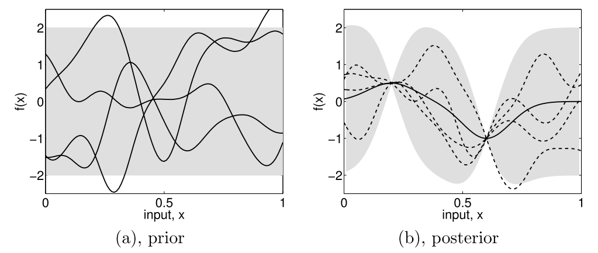

.. _surrogate:

Surrogate model
===============

Generalities
------------

A common class is used to manage surrogate models. Hence, several kind of surrogate
can be used. 

From *Kriging* to *Gaussian Process*
------------------------------------

Kriging, a geostatistical method
................................

*Kriging* is a geostatistical interpolation method that use not only the distance between the neighbouring points but also the relationships among these points, the autocorrelation. The method has been created by D.G. Krige [Krige1989]_ and has been formalized by G. Matheron [Matheron1963]_.

In order to predict an unmeasured location :math:`\hat{Y}`, interpolation methods use the surrounding measured values :math:`Y_i` and weight them:

.. math::
    \hat{Y} = \sum_{i = 1}^{N} \lambda_i Y_i.

The advantage of this method is that the interpolation is exact at the sampled points and that it gives an estimation of the prediction error. Ordinary *Kriging* consists in the *Best Linear Unbiased Predictor* (BLUP) [Robinson2008]_:

Best
    It minimizes the variance of the predicted error :math:`Var(\hat{Y} - Y)`,

Linear
    A linear combination of the data,

Unbiased
    It minimizes the mean square error :math:`E[\hat{Y} - Y]^2` thus :math:`\sum_{i=1}^{N} \lambda_i(x)=1`, 

Predictor
    It is an estimator of random effects.

:math:`\lambda_i` are calculated using the spatial autocorrelation of the data, it is a variography analysis. Plots can be constructed using semivariance, covariance or correlation. An empirical variogram plot allows to see the values that should be alike because they are close to each other \cite{Bohling2005}. The empirical semivariogram is given by:

.. math::
    \gamma(h) = \frac{1}{2}\times \frac{1}{n} \sum_{i=1}^{N} (Y_i - Y_{i+h})^2.

A fitting model is then applied to this semivariogram. Hence, the variability of the model is inferior to data's. Kriging smooths the gradients. The exponential model is written as:

.. math::
    \gamma(h) = C(0) + C\left(1- \exp{\left(-\frac{h}{r}\right)}\right),

with :math:`C` the correlation matrice and the parameter :math:`r` is optimized using the sample points.

.. image:: fig/semivariogramme.pdf

A model is described using:

Sill
    It corresponds to the maximum of :math:`\gamma`. It defines the end of the range.

Range
    It is the zone of correlation. If the distance is superior to the range, there is no correlation, whereas if the distance is inferior to it, the sample locations are autocorrelated.

Nugget
    If the distance between the points is null, :math:`\gamma` should be null. However, measurement errors are inherent and cause a nugget effect. It is the y-intercept of the model.

Once the model is computed, the weights are determined to use the *MSE* condition and gives:

.. math:: \lambda_i = K^{-1}k,
 
:math:`K` being the covariance matrix :math:`K_{i,j} = C(Y_i-Y_j)` and :math:`k` being the covariance vector :math:`k_i = C(Y_i-Y)` with the covariance :math:`C(h) = C(0) - \gamma(h) = Sill-\gamma(h)`.
 
.. math::
    \begin{pmatrix}\gamma_{11}& \cdots & \gamma_{1j} \\ \vdots & \ddots & \vdots \\ \gamma_{i1} & \cdots  & \gamma_{nn}  \end{pmatrix} \begin{pmatrix}\lambda_1 \\ \vdots \\ \lambda_n \end{pmatrix} = \begin{pmatrix} \gamma_{1X} \\ \vdots \\ \gamma_{nX}\end{pmatrix}.

Furthermore we can express the field :math:`Y` as :math:`\hat{Y} = R(S) + m(S)` which is the residual and the trend components [Bohling2005]_. Depending on the treatment of the trend, there are several Kriging techniques (ordinary Kriging being the most used):

Simple
    The variable is stationary, the mean is known,

Ordinary
    The variable is stationary, the mean is unknown,

Universal
    The variable is non-stationary, there is a tendency.

Ordinary Kriging is the most used method. In this case, the covariance matrix is augmented:

.. math::
    \begin{pmatrix}\gamma_{11}& \cdots  & \gamma_{1j} & 1\\ \vdots & \ddots & \vdots & \vdots \\ \gamma_{i1} & \cdots  & \gamma_{nn} & 1 \\ 1 & \cdots & 1 & 0 \end{pmatrix} \begin{pmatrix}\lambda_1 \\ \vdots \\ \lambda_n \\ - \mu \end{pmatrix} = \begin{pmatrix} \gamma_{1X} \\ \vdots \\ \gamma_{nX} \\ 1\end{pmatrix}.

Once the weights are computed, its dot product with the residual :math:`R_i=Y_i-m` at the known points gives the residual :math:`R(S)`. Thus we have an estimation of :math:`\hat{Y}`. Finally, the error is estimated by the second order moment:

.. math:: \sigma^2 =  \sum_{i = 1}^{N} \lambda_i \gamma_{iX} - \mu.

Some care has to be taken with this estimation of the variance. Being a good indicator of the correctness of the estimation, this is only an estimation of the error based upon all surrounding points.

Gaussian Process
................

There are two approaches when dealing with regression problems. In simple cases, we can use simple functions in order to approximate the output set of data. On the other hand, when dealing with complex multidimensional problems with strong non-linearity, there are infinite possibilities of functions to consider. This is where the Gaussian process comes in.

As stated by Rasmussen et al. in [Rasmussen2006]_, a process is a generalization of a probability distribution of functions. When dealing with *Gaussian processes*, they can simply be fully defined using the mean and covariance of the functions: 

.. math::
    f(x)&\sim GP(m(x), k(x,x')),\\
    m(x) &= \mathbb{E}\left[ f(x)  \right], \\
    k(x,x') &= \mathbb{E}\left[ (f(x) -m(x))(f(x')-m(x')) \right].

    Subfigure (a) shows four samples from a prior distribution. (b) shows the situation after two observations have been made. [Rasmussen2006]_.

Starting from a prior distribution of functions, it represents the belief we have on the problem. Without any assumption, the mean would be null. If we are now given a dataset :math:`D = \{(x_1, y_1), (x_2, y_2)\}`, we only consider the function that actually pass through or close to these points, as in the previous figure. This is the learning phase. The more points are added, the more the model will fit the function. Indeed, as we add observations, the error is reduced at these points.

The nature of the covariance matrix is of great importance as it fixes the properties of the functions to consider for inference. This matrix is also called *kernel*. Many covariance functions exist and they can be combined to fit specific needs. The Gaussian hypothesis formulation is equivalent to the Kriging. A common choice is the squared exponential covariance kernel:

.. math:: k(x, x') = \sqrt{\pi}l \sigma_p^2 \exp{- \frac{(x - x')^2}{2(\sqrt{2}l)^2}},

with :math:`l` the length scale, an hyperparameter, which depends on the magnitudes of the parameters. When dealing with a multidimensional case and non-homogeneous parameters, it is of prime importance to adimentionize everything as one input could bias the optimization of the hyperparameters. 

Then the Gaussian process regression is written as a linear regression:

.. math::
    \hat{f}(x_*)&= \sum_{i = 1}^{n}\alpha_i k (x_i, x_*),\\
    \alpha &= (K + \sigma_n^2 I)^{-1}y.

The Kriging method is one of the most employed as of today. We can even enhance the result of the regression if we have access to the derivative (or even the hessian) of the function [Forrester2009]_. This could be even more challenging if we don't have an adjoint solver to compute it. Another method is to use a multi-fidelity metamodel in order to obtain an even better solution. This can be performed if we have two codes that compute the same thing or if we have two grids to run from.

References
..........

.. [Krige1989] D.G. Krige, et al. “Early South African geostatistical techniques in today’s perspective”. Geostatistics 1. 1989.
.. [Matheron1963] G. Matheron. “Principles of Geostatistics”. Economic Geology 58. 1963.
.. [Robinson2008] G.K.Robinson.“That BLUP is a good thing: the estimation of random effects”. Statistical Science 6.1. 1991. DOI: 10.1214/ss/1177011926.
.. [Bohling2005] G. Bohling. "Kriging". Tech.rep. 2005.
.. [Forrester2009] Forrester and A.J. Keane.“Recent advances in surrogate-based optimization”. Progress in Aerospace Sciences 2009. DOI: 10.1016/j.paerosci.2008.11.001

Surrogate module
----------------

.. automodule:: batman.surrogate.surrogate_model
   :members:
   :undoc-members:

.. automodule:: batman.surrogate.kriging
   :members:
   :undoc-members:

.. automodule:: batman.surrogate.polynomial_chaos
   :members:
   :undoc-members:

.. automodule:: batman.surrogate.RBFnet
   :members:
   :undoc-members:

.. automodule:: batman.surrogate.TreeCut
   :members:
   :undoc-members:

