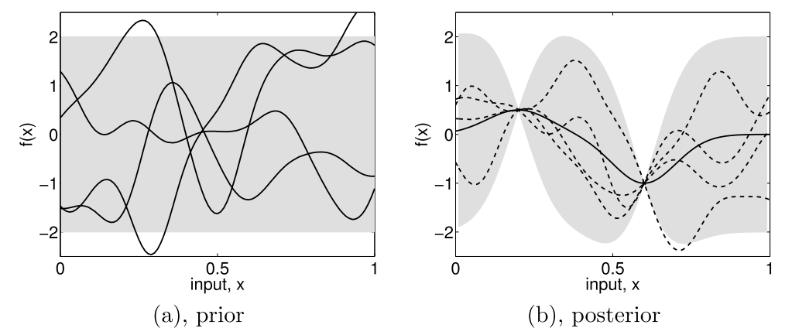

.. _surrogate:
.. currentmodule:: batman.surrogate

Surrogate model
===============

Generalities
------------

A common class is used to manage surrogate models. Hence, several kind of surrogate model strategies can be used::

    predictor = batman.surrogate.SurrogateModel('kriging', corners)
    predictor.fit(space, target_space)
    predictor.save('.')
    points = [(12.5, 56.8), (2.2, 5.3)]
    predictions = predictor(points)

From *Kriging* to *Gaussian Process*
------------------------------------

Kriging, a geostatistical method
................................

*Kriging* is a geostatistical interpolation method that use not only the distance between the neighbouring points but also the relationships among these points, the autocorrelation. The method has been created by D.G. Krige [Krige1989]_ and has been formalized by G. Matheron [Matheron1963]_.

In order to predict an unmeasured location :math:`\hat{Y}`, interpolation methods use the surrounding measured values :math:`Y_i` and weight them:

.. math::
    \hat{Y} = \sum_{i = 1}^{N} \lambda_i Y_i.

The advantage of this method is that the interpolation is exact at the sampled points and that it gives an estimation of the prediction error. Ordinary *Kriging* consists in the *Best Linear Unbiased Predictor* (BLUP) [Robinson1991]_:

Best
    It minimizes the variance of the predicted error :math:`Var(\hat{Y} - Y)`,

Linear
    A linear combination of the data,

Unbiased
    It minimizes the mean square error :math:`E[\hat{Y} - Y]^2` thus :math:`\sum_{i=1}^{N} \lambda_i(x)=1`, 

Predictor
    It is an estimator of random effects.

:math:`\lambda_i` are calculated using the spatial autocorrelation of the data, it is a variography analysis. Plots can be constructed using semivariance, covariance or correlation. An empirical variogram plot allows to see the values that should be alike because they are close to each other \cite{Bohling2005}. The empirical semivariogram is given by:

.. math::
    \gamma(h) = \frac{1}{2}\times \frac{1}{n} \sum_{i=1}^{N} (Y_i - Y_{i+h})^2.

A fitting model is then applied to this semivariogram. Hence, the variability of the model is inferior to data's. Kriging smooths the gradients. The exponential model is written as:

.. math::
    \gamma(h) = C(0) + C\left(1- \exp{\left(-\frac{h}{r}\right)}\right),

with :math:`C` the correlation matrice and the parameter :math:`r` is optimized using the sample points.

.. image:: ../fig/semivariogramme.pdf

A model is described using:

Sill
    It corresponds to the maximum of :math:`\gamma`. It defines the end of the range.

Range
    It is the zone of correlation. If the distance is superior to the range, there is no correlation, whereas if the distance is inferior to it, the sample locations are autocorrelated.

Nugget
    If the distance between the points is null, :math:`\gamma` should be null. However, measurement errors are inherent and cause a nugget effect. It is the y-intercept of the model.

Once the model is computed, the weights are determined to use the *MSE* condition and gives:

.. math:: \lambda_i = K^{-1}k,
 
:math:`K` being the covariance matrix :math:`K_{i,j} = C(Y_i-Y_j)` and :math:`k` being the covariance vector :math:`k_i = C(Y_i-Y)` with the covariance :math:`C(h) = C(0) - \gamma(h) = Sill-\gamma(h)`.
 
.. math::
    \begin{pmatrix}\gamma_{11}& \cdots & \gamma_{1j} \\ \vdots & \ddots & \vdots \\ \gamma_{i1} & \cdots  & \gamma_{nn}  \end{pmatrix} \begin{pmatrix}\lambda_1 \\ \vdots \\ \lambda_n \end{pmatrix} = \begin{pmatrix} \gamma_{1X} \\ \vdots \\ \gamma_{nX}\end{pmatrix}.

Furthermore we can express the field :math:`Y` as :math:`\hat{Y} = R(S) + m(S)` which is the residual and the trend components [Bohling2005]_. Depending on the treatment of the trend, there are several Kriging techniques (ordinary Kriging being the most used):

Simple
    The variable is stationary, the mean is known,

Ordinary
    The variable is stationary, the mean is unknown,

Universal
    The variable is non-stationary, there is a tendency.

Ordinary Kriging is the most used method. In this case, the covariance matrix is augmented:

.. math::
    \begin{pmatrix}\gamma_{11}& \cdots  & \gamma_{1j} & 1\\ \vdots & \ddots & \vdots & \vdots \\ \gamma_{i1} & \cdots  & \gamma_{nn} & 1 \\ 1 & \cdots & 1 & 0 \end{pmatrix} \begin{pmatrix}\lambda_1 \\ \vdots \\ \lambda_n \\ - \mu \end{pmatrix} = \begin{pmatrix} \gamma_{1X} \\ \vdots \\ \gamma_{nX} \\ 1\end{pmatrix}.

Once the weights are computed, its dot product with the residual :math:`R_i=Y_i-m` at the known points gives the residual :math:`R(S)`. Thus we have an estimation of :math:`\hat{Y}`. Finally, the error is estimated by the second order moment:

.. math:: \sigma^2 =  \sum_{i = 1}^{N} \lambda_i \gamma_{iX} - \mu.

Some care has to be taken with this estimation of the variance. Being a good indicator of the correctness of the estimation, this is only an estimation of the error based upon all surrounding points.

Gaussian Process
................

There are two approaches when dealing with regression problems. In simple cases, we can use simple functions in order to approximate the output set of data. On the other hand, when dealing with complex multidimensional problems with strong non-linearity, there are infinite possibilities of functions to consider. This is where the Gaussian process comes in.

As stated by Rasmussen et al. in [Rasmussen2006]_, a process is a generalization of a probability distribution of functions. When dealing with *Gaussian processes*, they can simply be fully defined using the mean and covariance of the functions: 

.. math::
    f(x)&\sim GP(m(x), k(x,x')),\\
    m(x) &= \mathbb{E}\left[ f(x)  \right], \\
    k(x,x') &= \mathbb{E}\left[ (f(x) -m(x))(f(x')-m(x')) \right].

    Subfigure (a) shows four samples from a prior distribution. (b) shows the situation after two observations have been made. [Rasmussen2006]_.

Starting from a prior distribution of functions, it represents the belief we have on the problem. Without any assumption, the mean would be null. If we are now given a dataset :math:`D = \{(x_1, y_1), (x_2, y_2)\}`, we only consider the function that actually pass through or close to these points, as in the previous figure. This is the learning phase. The more points are added, the more the model will fit the function. Indeed, as we add observations, the error is reduced at these points.

The nature of the covariance matrix is of great importance as it fixes the properties of the functions to consider for inference. This matrix is also called *kernel*. Many covariance functions exist and they can be combined to fit specific needs. A common choice is the squared exponential covariance kernel:

.. math:: k(x, x') = \sqrt{\pi}l \sigma_p^2 \exp{- \frac{(x - x')^2}{2(\sqrt{2}l)^2}},

with :math:`l` the length scale, an hyperparameter, which depends on the magnitudes of the parameters. When dealing with a multidimensional case and non-homogeneous parameters, it is of prime importance to adimentionize everything as one input could bias the optimization of the hyperparameters. 

Then the Gaussian process regression is written as a linear regression

.. math::
    \hat{f}(x_*)&= \sum_{i = 1}^{n}\alpha_i k (x_i, x_*),\\
    \alpha &= (K + \sigma_n^2 I)^{-1}y.

One of the main benefit of this method, is that it provides an information about the variance

.. math::
    \mathbb{V}[f(\mathbf{x}_*)] = k(\mathbf{x}_*, \mathbf{x}_*)-\mathbf{k}(\mathbf{x}_*)^T(K + \sigma_n^2 I)^{-1}\mathbf{k}(\mathbf{x}_*).

The Kriging method is one of the most employed as of today. We can even enhance the result of the regression if we have access to the derivative (or even the hessian) of the function [Forrester2009]_. This could be even more challenging if we don't have an adjoint solver to compute it. Another method is to use a multi-fidelity metamodel in order to obtain an even better solution. This can be performed if we have two codes that compute the same thing or if we have two grids to run from.

.. _pce:

Polynomial chaos expansion
--------------------------

Polynomial chaos expansion (PCE) is a type of surrogate model widely used in uncertainty quantification studies. It takes place in a stochastic framework where model inputs are random variables whose probabilistic distributions determine the families of polynomial regressors. We set out below the details of a PCE construction and its implementation with BATMAN.

Generalities
............

Input scaling
*************

Let :math:`\mathbf{X}=(X_1, X_2, \ldots, X_d)` be the random input vector defined in the input physical space :math:`\mathbb{X}\subset\mathbb{R}^d`. The :math:`i^{\text{th}}` component :math:`X_i` of :math:`\mathbf{X}` is transformed into a new random variable :math:`\zeta_i` obtained by the following centering and scaling operation: 

.. math::

   \tilde{X}_i:=\frac{X_i-\mu_i}{\sigma_i}

where :math:`\mu_i=N^{-1}\sum_{k=1}^Nx_i^{(k)}` and :math:`\sigma_i=\sqrt{(N-1)^{-1}\sum_{k=1}^N\left(x_i^{(k)}-\mu_i\right)^2}` are respectively the empirical mean and standard deviation of :math:`X_i` computed from a :math:`N`-sample :math:`(\mathbf{X}^{(1)},\mathbf{X}^{(2)},\ldots,\mathbf{X}^{(N)})`. The random vector :math:`\tilde{X}=(\tilde{X}_1,\tilde{X}_1,\ldots,\tilde{X}_d)` evolves in a space noted :math:`\tilde{\mathbb{X}}`.

Polynomial expansion
********************

Let :math:`\mathbf{Y}=(Y_1,Y_2,\ldots,Y_p)=f(\mathbf{X})` be the random model output with values in :math:`\mathbb{R}^p`. Assuming that the model output :math:`Y_j` is of finite variance, each component :math:`Y_j` can be considered as a random variable for which there exists a polynomial expansion of the form:

.. math::
   
   Y_j = \displaystyle\sum_{i > 0}\,\gamma_{j,i}\,\Psi_{i}\left(\tilde{\mathbf{X}}\right)=:y_j(\mathbf{X}).

where :math:`\lbrace\Psi_{i}\rbrace_{i\geq 0}` is a basis of orthonormal polynomial functions:

.. math::

   <\Psi_i, \Psi_j> = \delta_{ij}

with :math:`<f, g>\equiv\int_{\tilde{\mathbb{X}}} f(\tilde{\mathbf{x}})g(\tilde{\mathbf{x}}) \rho(\tilde{\mathbf{x}}) \mathrm{d}\tilde{\mathbf{x}}` and :math:`\delta_{ij}` the Kronecker delta function,

and where :math:`\gamma_{j,i}` is the coefficient of the projection of :math:`y_j` onto :math:`\Psi_i`:

.. math::

   \gamma_{j,i}=<y_j, \Psi_i>.

Polynomial basis
****************

In practice, this orthonormal basis is built using the tensor product of :math:`d` 1-D polynomial functions coming from :math:`d` different orthonormal basis: 

.. math::

   \Psi_i(\tilde{\mathbf{x}})=\Psi_{i_1(i)}(\tilde{x}_1)\otimes\Psi_{i_2(i)}(\tilde{x}_2)\otimes\ldots\otimes\Psi_{i_d(i)}(\tilde{x}_d),

where :math:`\left(i_1(i),i_2(i),\ldots,i_d(i)\right)\in\mathbb{N}^d` is the multi-index associated to the integer :math:`i\in\mathbb{N}`. The bijective application :math:`i_{1,2,\ldots,d}=(i_1,i_2,\ldots,i_d):\mathbb{N}\rightarrow\mathbb{N}^d` is an enumerate function to chose (see :ref:`PceEnumerateStategies`).

The choice for the basis functions depends on the probability measure of the random input variables :math:`\zeta_1,\zeta_2,\ldots,\zeta_d`. According to the Askey's scheme, the Hermite polynomials form the optimal basis for random variables following the standard Gaussian distribution:

.. math::

   \forall n\in\mathbb{N},~H_{n+1}(x) = xH_n(x) - nH_{n-1}(x) \text{ with }H_{0}(x)=1\text{ and }H_{1}(x)=x

and the Legendre polynomials are the counterpart for the standard uniform distribution:

.. math::

   \forall n\in\mathbb{N},~L_{n+1}(x) = \frac{2n+1}{n+1}xL_n(x) - \frac{n}{n+1}L_{n-1}(x) \text{ with }L_{0}(x)=1\text{ and }L_{1}(x)=x.

Note that even if standard uniform and Gaussian distributions are widely used to represent input variable uncertainty, the Askey's scheme can also be applied to a wider set of distributions [xiu2002]_.

Surrogate model
***************

From a deterministic point of view, for a given realization :math:`\mathbf{x}` of :math:`\mathbf{X}` and based on the previous variable change, we have:

.. math::

   y_j\left(\mathbf{x}\right):=\displaystyle\sum_{i \geq 0}\,\gamma_{j,i}\,\Psi_{i}\left(\tilde{\mathbf{x}}\right).

In practice, we use a truncation strategy (see :ref:`PceTruncationStategies`) limiting this polynomial expansion to the more significant elements in terms of explained output variance:

.. math::

   \hat{y}_j\left(\mathbf{x}\right):=\displaystyle\sum_{i = 0}^r\,\gamma_{j,i}\,\Psi_{i}\left(\tilde{\mathbf{x}}\right).

Thus, :math:`\hat{\mathbf{y}}=(\hat{y}_1,\hat{y}_2,\ldots,\hat{y}_p)` is a surrogate model of :math:`\mathbf{y}=(y_1,y_2,\ldots,y_p)`.

Properties
..........

Various statistical moments associated to the PC surrogate model have explicit formulations, thus avoiding Monte-Carlo sampling, even if this metamodel is computationally cheap.

For the :math:`j^{\text{th}}` output, the expectation reads:

.. math::

   \mathbb{E}\left[\hat{y}_j\left(\mathbf{X}\right)\right]=\gamma_{j,0}

For the :math:`j^{\text{th}}` output, the variance reads:

.. math::

   \mathbb{V}\left[\hat{y}_j\left(\mathbf{X}\right)\right]=\sum_{i = 1}^r\gamma_{j,i}^2

For the :math:`j^{\text{th}}` and :math:`k^{\text{th}}` outputs, the expectation reads:

.. math::

   \mathbb{C}\left[\hat{y}_j,\hat{y}_k\left(\mathbf{X}\right)\right]=\sum_{i = 1}^r\gamma_{j,i}\gamma_{k,i}

In the context of global sensitivity analysis, there are similar results for the Sobol' indices [sudret2008]_.

Options
.......

.. _PceEnumerateStategies:

Enumerate strategies
********************

Remind that:

- :math:`\forall i\in\{0,1,\ldots,r\},~\Psi_i(\tilde{\mathbf{x}})=\Psi_{1,i_1(i)}(\tilde{x}_1)\otimes\Psi_{2,i_2(i)}(\tilde{x}_2)\otimes\Psi_{d,i_d(i)}(\tilde{x}_d)`.
- :math:`\forall k\in\{1,2,\ldots,d\},~\{\Psi_{k,i}\}_{0\leq i \leq P}` are the :math:`P+1` first elements of the polynomial basis associated to :math:`X_k` and their degrees are lower or equal to :math:`P`.
- :math:`\forall i\in\{0,1,\ldots,r\},~\forall k\in\{1,2,\ldots,d\},~\text{degree}(\Psi_{k,i_k(i)})=i_k(i)\leq P`.
- :math:`\forall i\in\{0,1,\ldots,r\},~\text{degree}(\Psi_{i})=\sum_{k=1}^d\text{degree}(\Psi_{k,i_k(i)})\leq P`.

An enumerate function is a bijective application from :math:`\{0,1,\ldots,P\}` to :math:`\{0,1,\ldots,P\}^d` of the form:

.. math::

   i\mapsto i_{1,2,\ldots,d}(i)=(i_1(i),i_2(i),\ldots,i_d(i)).

The bijectivity property implies that the initial term is:

.. math::

   i_{1,2,\ldots,d}(0)=\{0,0,\ldots,0\}

and the next ones satisfy the constraint:

.. math::

   \forall 0\leq i \leq j,~ \text{degree}(\Psi_i)<\text{degree}(\Psi_j) \Leftrightarrow \forall 0\leq i \leq j,~ \sum_{k=1}^d i_k(i) < \sum_{k=1}^d i_k(j)

or 

.. math::

   \forall 1\leq i \leq j,~\exists m \in\{1,2,\ldots,d\}:~(\forall k\leq m,~i_k(i)=i_k(j))~\text{ and }~ (i_m(i)<i_m(j)).

**Linear enumerate function**

A natural linear enumerate strategy is the lexicographical order with a constraint of increasing total degree. The unique requirement of this strategy is the input space dimension :math:`d`.

**Hyperbolic anisotropic enumerate function**

Hyperbolic truncation strategy gives an advantage to the main effects and low-order interactions. From a multi-index point of view, this selection implies to discard multi-indices including an important number of non-zeros components.

:math:`\forall q \in ]0, 1]`, the anisotropic hyperbolic norm of a multi-index :math:`\boldsymbol{\alpha}\in\mathbb{R}^d` is defined by:

.. math::

   \| \boldsymbol{\alpha} \|_{\mathbf{w}, q} = \left( \sum_{k=1}^{d} w_k \alpha_k^q \right)^{1/q}

where the :math:`w_k`‘s are real positive numbers. In the case where :math:`\mathbf{w}=(1,1,\ldots,1)`, the strategy is isotropic.

.. _PceTruncationStategies:

Truncation strategies
*********************

In this section, we present different truncation strategies.

Note that for small :math:`d`, advanced truncation strategies that consist in eliminating high-order interaction terms or using sparse structure [blatman2009phd]_ [migliorati2013]_ are not necessary.

**Fixed truncation strategy**

The standard truncation strategy consists in constraining the number of terms :math:`r` by the number of random variables :math:`d` and by the total polynomial degree :math:`P` of the PCE. Precisely, the choice of :math:`r` is equal to:

.. math::

   r = \frac{(d + P)!}{d!\,P!}.

All the polynomials :math:`\Psi_i` involving the :math:`d` random variables with a total degree less or equal to :math:`P` are retained in the PC expansion. Then, the PC approximation of :math:`y_j` is formulated as:

.. math::

   \widehat{y}_j(\mathbf{x}) = \displaystyle\sum_{0\leq i \leq r}\,\gamma_{j,i}\,\Psi_i\left(\tilde{\mathbf{x}}\right) = \displaystyle\sum_{i\in\mathbb{N}\atop\sum_{k=1}^di_k(i)\leq P}\,\gamma_{j,i}\,\Psi_i\left(\tilde{\mathbf{x}}\right).

.. warning:: The number of terms :math:`r` grows polynomially both in :math:`d` and :math:`P` though, which may lead to difficulties in terms of computational efficiency and memory requirements when dealing with high-dimensional problems.

**Sequential truncation strategy**

The sequential strategy consists in constructing the basis of the truncated PC iteratively. Precisely, one begins with the first term :math:`\Psi_0`, that is :math:`K_0 = \{0\}`, and one complements the current basis as follows: :math:`K_{i+1} = K_i \cup \{\Psi_{i+1}\}`. The construction process is stopped when a given accuracy criterion is reached, or when :math:`i` is equal to a prescribed maximum basis size :math:`r`.

**Cleaning truncation strategy**

The cleaning strategy aims at building a PC expansion containing at most :math:`r` significant coefficients, i.e. at most :math:`r` significant basis functions. It proceeds as follows:

- Generate an initial PC basis made of the :math:`r` first polynomials (according to the adopted EnumerateFunction), or equivalently an initial set of indices :math:`\mathcal{I} = \{0, \ldots, r-1\}`.
- Discard from the basis all those polynomials :math:`\Psi_i` associated with insignificance coefficients, i.e. the coefficients that satisfy:

.. math::

   |\gamma_i| \leq \epsilon \times \max_{ i' \in \mathcal{I} } |\gamma_{i'}|

where :math:`\epsilon` is the significance factor, default is :math:`\epsilon = 10^{-4}`.

- Add the next basis term :math:`\Psi_{i+1}` to the current basis :math:`\mathcal{I}`.
- Reiterate the procedure until either :math:`r` terms have been retained or if the given maximum index :math:`r_{\text{max}}` has been reached.

Coefficient calculation strategies
**********************************

We focus here on non-intrusive approaches to numerically compute the coefficients :math:`\lbrace\gamma_{j,i}\rbrace_{0\leq i \leq r\\ 1\leq j \leq p}` using :math:`N` snapshots from :math:`\mathcal{D}_N`. 

**Least-square strategy**

Based on a :math:`N`-sample :math:`\left(\mathbf{X}^{(k)},\mathbf{Y}^{(k)}\right)_{1\leq k \leq N}`, the least-square strategy seeks the solution of the optimization problem:

.. math::

   \hat{\boldsymbol{\gamma}}=\underset{\boldsymbol{\gamma}\in\mathbb{R}^r}{\operatorname{argmin}} \sum_{k=1}^N \sum_{j=1}^p \left(y_j^{(k)}-\displaystyle\sum_{0\leq i \leq r}\,\gamma_{j,i}\,\Psi_i\left(\tilde{\mathbf{x}}^{(k)}\right)\right)^2

which is achieved through classical linear algebra tools.

Note that the sample size :math:`N` required by this strategy is at least equal to :math:`p(r+1)` where :math:`r` is the number of PC coefficients and :math:`p` is the output vector dimension.

**Quadrature strategy**

The spectral projection relies on the orthonormality property of the polynomial basis. For the :math:`j^{\text{th}}`, the :math:`i^{\text{th}}` coefficient :math:`\gamma_{j,i}` is computed using a Gaussian quadrature rule as:

.. math::

   \gamma_{j,i} = <y_j,\Psi_i> \,\cong\,\displaystyle\sum_{k = 1}^{N}\,y_j^{(k)}\,\Psi_i(\tilde{\mathbf{x}}^{(k)})\,w^{(k)}

where:

- :math:`\mathbf{y}^{(k)} = \mathcal{M}(\mathbf{x}^{(k)})` is the evaluation of the simulator at the :math:`k^{\text{th}}` quadrature root :math:`\tilde{\mathbf{x}}^{(k)}` of :math:`\Psi_i`,
- :math:`w^{k}` is the weight associated to :math:`\mathbf{x}^{(k)}`. 

Note that the number of quadrature roots required in each uncertain direction to ensure an accurate calculation of the integral :math:`<y_j,\Psi_i>` is equal to :math:`(P+1)`.

Implementation
..............

Concerning the library BATMAN, polynomial chaos expansion has to be specified in the block **surrogate** of the JSON settings file, setting the keyword **method** at **pc** and eventually using ones of the following keywords:

+-------------------+--------------------------------------+----------------------------------------------------------------------------------------------------------+
| Keywords          | Type                                 | Description                                                                                              |
+===================+======================================+==========================================================================================================+
| **strategy**      | string                               | Strategy for the weight computation:                                                                     |
|                   |                                      |                                                                                                          |
|                   |                                      | - least square: **LS**                                                                                   |
|                   |                                      | - quadrature: **Quad**                                                                                   |
+-------------------+--------------------------------------+----------------------------------------------------------------------------------------------------------+
| **degree**        | integer                              | Total polynomial degree :math:`P`                                                                        |
+-------------------+--------------------------------------+----------------------------------------------------------------------------------------------------------+
| **distributions** | list(:class:`openturns.Distribution`)| Distributions of each input parameter                                                                    |
+-------------------+--------------------------------------+----------------------------------------------------------------------------------------------------------+
| **n_sample**      | integer                              | Number of samples for least square                                                                       |
+-------------------+--------------------------------------+----------------------------------------------------------------------------------------------------------+

Multifidelity
-------------

It is possible to combine several level of fidelity in order to lower the computational cost of the surrogate
building process. The fidelity can be either expressed as a mesh difference, a convergence difference, or even a
different set of solvers. [Forrester2006]_ proposed a way of combining these fidelities by building a low
fidelity model and correct it using a model of the error:

.. math:: \hat{f}(x) = f_c(x) + \hat{f}_{\epsilon}(f_e(x), f_c(x)),

with :math:`\hat{f}_{\epsilon}` the surrogate model representing the error between the two fidelity levels.
This method needs nested design of experiments for the error model to be computed.

Considering two levels of fidelity :math:`f_e` and :math:`f_c`, respectively an expensive and a cheap function expressed as a computational cost. A cost ratio :math:`\alpha` between the two can be defined as:

.. math:: \alpha = \frac{f_e}{f_c}.

Using this cost relationship an setting a computational budget :math:`C`, it is possible to get a relation between the number of cheap and expensive realizations:

.. math:: C f_e &= N_e f_e + N_c f_c,\\
          C f_e &= N_e f_e + N_c\frac{\alpha}{f_e},\\
          C &= N_e + N_c\alpha, \\
          N_c &= \frac{C - N_e}{\alpha}.

As the design being nested, the number of cheap experiments must be strictly superior to the number or expensive ones. Indeed, the opposite would result in no additional information to the system.
