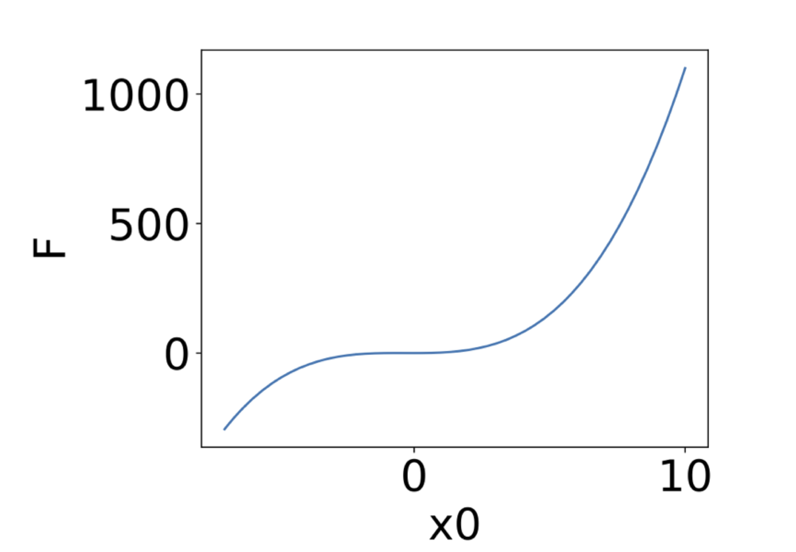
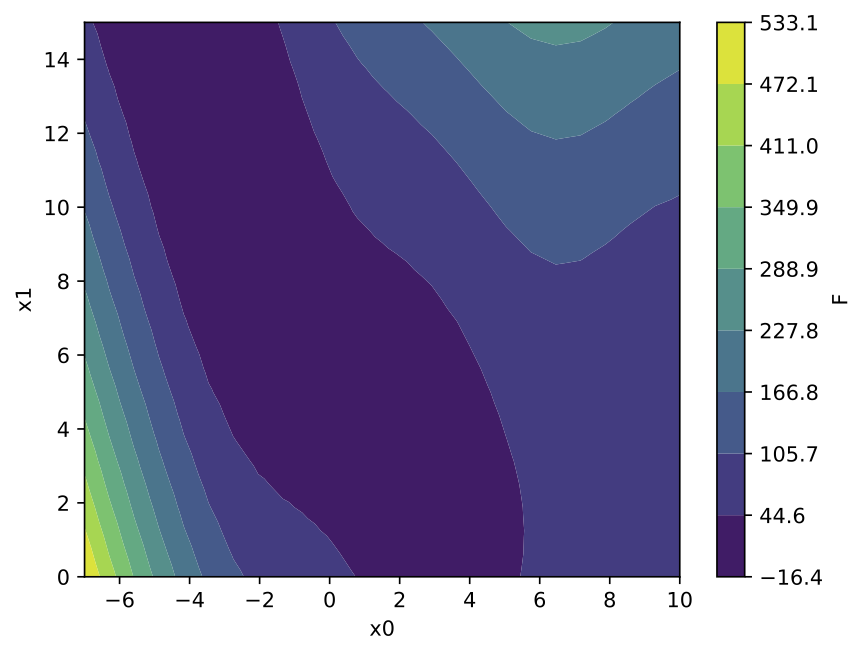
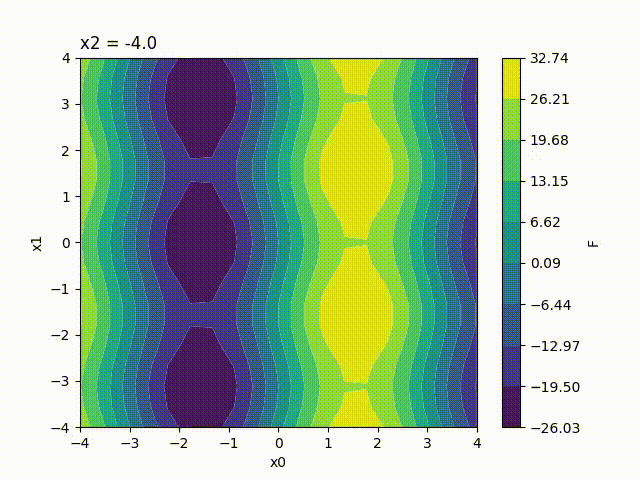
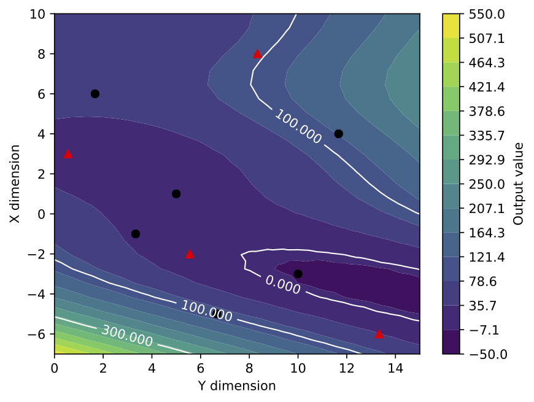
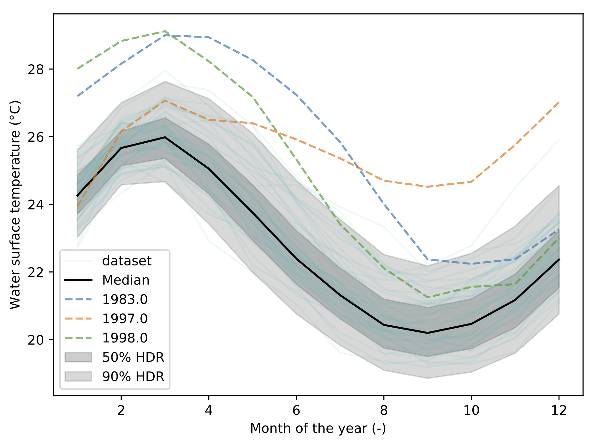
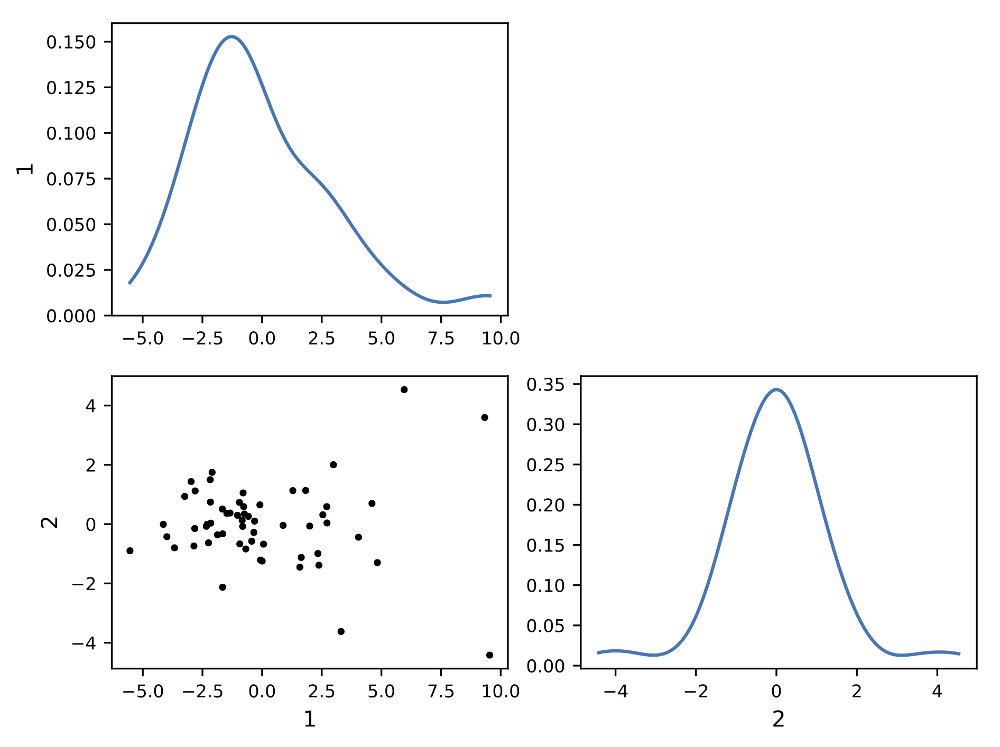
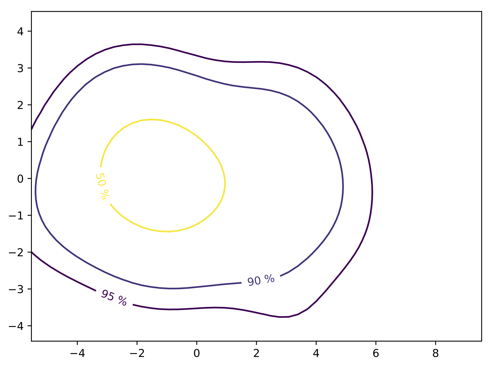
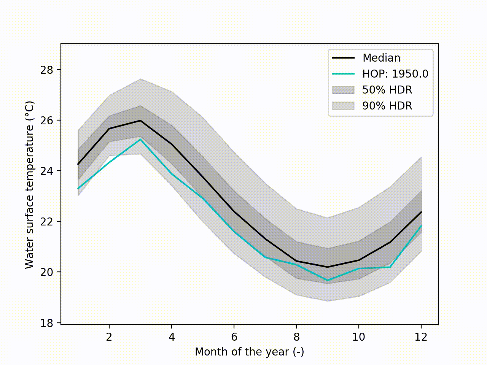
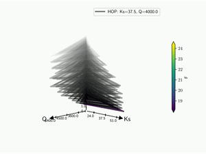

.. _visualization:
.. currentmodule:: batman.visualization

Uncertainty Visualization
*************************

Be able to visualize uncertainty is often neglected but it is a challenging topic.
Depending on the number of input parameters and the dimension of the quantitie of interest,
there are several options implemented in the package.

+----------------------------------+----------------------------+---------------------------------------+
|        Function or class         |       Dimensionality       |            Description                |
+                                  +----------------------------+                                       +
|                                  | Input     | Output         |                                       |
+----------------------------------+-----------+----------------+---------------------------------------+
| :func:`doe`                      | n-scalar  | scalar, vector | Design of Experiment                  |
+----------------------------------+-----------+----------------+---------------------------------------+
| :func:`response_surface`         | <5 scalar | scalar, vector | Response surface (fig or movies)      |
+----------------------------------+-----------+----------------+---------------------------------------+
| :class:`HdrBoxplot`              | vector    | vector         | Median realization with PCA           |
+----------------------------------+-----------+----------------+---------------------------------------+
| :class:`Kiviat3D`                | >5 scalar | scalar, vector | 3D version of the radar/spider plot   |
+----------------------------------+-----------+----------------+---------------------------------------+
| :class:`Tree`                    | 2D scalar | scalar, vector | 2D version (kind) of the Kiviat plot  |
+----------------------------------+-----------+----------------+---------------------------------------+
| :func:`pdf`                      |           | scalar, vector | Output PDF                            |
+----------------------------------+-----------+----------------+---------------------------------------+
| :func:`corr_cov`                 | scalar    | vector         | Correlation of the inputs and outputs |
+----------------------------------+-----------+----------------+---------------------------------------+
| :func:`sobol`                    | scalar    | scalar, vector | Sensitivity indices                   |
+----------------------------------+-----------+----------------+---------------------------------------+

All options return a figure object that can be reuse using :func:`reshow`.
This enables some modification of the graph. In most cases, the first parameter ``data`` is
of shape ``(n_samples, n_features)``.

Response surface
================

What is it?
-----------

A response surface can be created to visualize the surrogate model as a function
of two input parameters, the surface itself being colored by the value of the
function. The response surface is automatically plotted when requesting uncertainty
quantification if the number of input parameters is less than 5. For a larger
number of input parameters, a Kiviat-3D graph is plotted instead (see Kiviat 3D
section).

If only 1 input parameter is involved, the response surface reduces to a response
function. The default display is the following:

If exactly 2 input parameters are involved, it is possible to generate the
response surface, the surface itself being colored by the value of the function.
The corresponding values of the 2 input parameters are displayed on the x and y
axis, with the following default display:

Because the response surface is a 2D picture, a set of response surfaces is generated
when dealing with 3 input parameters. The value of the 3rd input parameter is fixed
to a different value on each plot. The obtained set of pictures is concatenated
to one single movie file in mp4 format:

Finally, response surfaces can also be plotted for 4 input parameters. A set of
several movies is created, the value of the 4th parameter being fixed to a
different value on each movie.

Options
-----------

Several display options can be set by the user to modify the created response
surface. All the available options are listed in the following table:

+-------------+-------------------+-------------------+-----------------------------------------+
| Option      || Dimensionality   || Default          ||              Description               |
+ name        +                   +                   +                                         +
+=============+===================+===================+=========================================+
| bounds      || Array-like.      || None             || Specify new bounds for the response    |
|             |                   |                   || surface. Space corners are used if no- |
|             |                   |                   || thing is specified. Values should have |
|             |                   |                   || the same dimension as space corners and|
|             |                   |                   || the new domain should be included      |
|             |                   |                   || inside the space corners.              |
+-------------+-------------------+-------------------+-----------------------------------------+
| doe         || Array-like.      || None             || Display the Design of Experiment on    |
|             |                   |                   || graph, represented by black dots.      |
+-------------+-------------------+-------------------+-----------------------------------------+
| resampling  || Integer.         || None             || Display the n last DoE points in red   |
|             |                   |                   || to easily identify the resampling.     |
+-------------+-------------------+-------------------+-----------------------------------------+
| xdata       || List of          || If output is a   || Only used if the output is a vector.   |
|             || real numbers.    || scalar: None     || Specify the discretisation of the      |
|             ||                  || If output is a   || output vector for 1D response function |
|             || Size = length    || vector: regular  || and for integration of the output      |
|             || of the output    || discretisation   || before plotting 2D response function.  |
|             || vector.          || between 0 and 1  |                                         |
+-------------+-------------------+-------------------+-----------------------------------------+
| axis_disc   || List of          || 50 in 1D         || Discretisation of the response surface |
|             || integers.        || 25,25 in 2D      || on each axis. Values of the 1st and 2nd|
|             ||                  || 20,20,20 in 3D   || parameters influence the resolution,   | 
|             || One              || 15,15,15,15 in 4D|| values for the 3rd and 4th parameters  |
|             || value per        |                   || influence the number of frame per movie|
|             || parameter.       |                   || and the movie number respectively.     |
+-------------+-------------------+-------------------+-----------------------------------------+
| flabel      || String.          || 'F'              || Name of the output function.           |
+-------------+-------------------+-------------------+-----------------------------------------+
| plabels     || List of          || 'x0' for 1st dim || Name of the input parameters to be     |
|             || string.          || 'x1' for 2nd dim || on each axis.                          |
|             || One chain per    || 'x2' for 3rd dim |                                         |
|             || parameter.       || 'x3' for 4th dim |                                         |
+-------------+-------------------+-------------------+-----------------------------------------+
| feat_order  || List of          || 1 in 1D          || Axis on which each parameter should be |
|             || integers.        || 1,2 in 2D        || plotted. The parameter in 1st position |
|             ||                  || 1,2,3 in 3D      || is plotted on the x-axis and so on...  |
|             || One value per    || 1,2,3,4 in 4D    || All integer values from 1 to the total |
|             || parameter.       |                   || dimension number should be specified.  |
+-------------+-------------------+-------------------+-----------------------------------------+
| ticks_nbr   || Integer.         || 10               || Number of ticks in the colorbar.       |
+-------------+-------------------+-------------------+-----------------------------------------+
| range_cbar  || List of          || Minimal and      || Minimal and maximal values in the      |
|             || real numbers.    || maximal values in|| colorbar. Output values that are out   |
|             || Two values.      || output data      || of this scope are plotted in white.    |
+-------------+-------------------+-------------------+-----------------------------------------+
| contours    || List of          || None             || Values of the iso-contours to plot.    |
|             || real numbers.    |                   |                                         |
+-------------+-------------------+-------------------+-----------------------------------------+
| fname       || String.          || 'Response_surface|| Name of the response surface file(s).  |
|             |                   || .pdf'            || Can be followed by an additional int.  |
+-------------+-------------------+-------------------+-----------------------------------------+

Example
-----------

As an example, the previous response surface for 2 input parameters is now plotted
with its design of experiment, 4 of the points being indicated as a later resampling
(4 red triangles amongs the black dots). Additional iso-contours are added to the graph
and the axis corresponding the each input parameters are interverted. Note also the new
minimal and maximal values in the colorbar and the increased color number. Finally, the
names of the input parameters and of the cost function are also modified for more explicit
ones.

HDR-Boxplot
===========

What is it?
-----------

This implements an extension of the highest density region boxplot technique
[Hyndman2009]_. When you have functional data, which is to say: a curve, you
will want to answer some questions such as:

* What is the median curve?
* Can I draw a confidence interval?
* Or, is there any outliers?

This module allows you to do exactly this: 

.. code-block:: python
    
    import batman as bat
    data = np.loadtxt('data/elnino.dat')
    print('Data shape: ', data.shape)

    hdr = bat.visualization.HdrBoxplot(data)
    hdr.plot()

The output is the following figure: 

How does it work?
-----------------

Behind the scene, the dataset is represented as a matrix. Each line corresponding
to a 1D curve. This matrix is then decomposed using Principal Components
Analysis (PCA). This allows to represent the data using a finit number of
modes, or components. This compression process allows to turn the functional
representation into a scalar representation of the matrix. In other words, you
can visualize each curve from its components. With 2 components, this is called
a bivariate plot:

This visualization exhibit a cluster of points. It indicate that a lot of
curve lead to common components. The center of the cluster is the mediane curve.
An the more you get away from the cluster, the more the curve is unlikely to be
similar to the other curves.

Using a kernel smoothing technique (see :ref:`PDF <PDF>`), the probability density function (PDF) of
the multivariate space can be recover. From this PDF, it is possible to compute
the density probability linked to the cluster and plot its contours.

Finally, using these contours, the different quantiles are extracted allong with
the mediane curve and the outliers.

Uncertainty visualization
-------------------------

Appart from these plots. It implements a technique called Hypothetical Outcome
plots (HOPs) [Hullman2015]_ and extend this concept to functional data. Using
the HDR Boxplot, each single realisation is superposed. All these frames
are then assembled into a movie. The net benefit is to be able to observe the
spatial/temporal correlations. Indeed, having the median curve and some intervals
does not indicate how each realisation are drawn, if there are particular
patterns. This animated representation helps such analysis::

    hdr.f_hops()

Another possibility is to visualize the outcomes with sounds. Each curve is
mapped to a series of tones to create a song. Combined to the previous *f-HOPs*
this opens a new way of looking at data::

    hdr.sound()

.. note:: The ``hdr.sound()`` output is an audio `wav` file. A combined video
         can be obtain with *ffmpeg*::

             ffmpeg -i f-HOPs.mp4 -i song-fHOPs.wav mux_f-HOPs.mp4

         The *gif* is obtain using::

            ffmpeg -i f-HOPs.mp4 -pix_fmt rgb8 -r 1 data/f-HOPs.gif

Kiviat 3D
=========

The HDR technique is usefull for visualizing functional output but it does not
give any information on the input parameter used. Radar plot or Kiviat plot can
be used for this purpose. A single realisation can be seen as a 2D kiviat plot
which different axes each represent a given parameter. The surface itself being
colored by the value of the function.

.. image::  ../fig/kiviat_2D.pdf

To be able to get a whole set of sample, a 3D version of the Kiviat plot is
used [Hackstadt1994]_. Thus, each sample corresponds to a 2D Kiviat plot::

    import batman as bat
    kiviat = bat.visualization.Kiviat3D(space, feval, bounds)
    kiviat.plot()

.. image::  ../fig/kiviat_3D.pdf

Note that only the DOE points are plotted in the Kiviat plot in order to
limit the number of surfaces to visualize. Surrogate model is thus never used
to predict the value of the function.

Several visualization options used for the response surfaces generation can
be used to create the Kiviat plot. Options working with Kiviat plot are
*flabel*, *plabels*, *ticks_nbr* and *range_cbar*. All other options are not
read and does not impact the output graph.

When dealing with functional output, the color of the surface does not gives
all the information on a sample as it can only display a single information:
the median value in this case. Hence, the proposed approach is to combine a
functional-HOPs-Kiviat with sound::

    batman.visualization.kiviat.f_hops(fname=os.path.join(tmp, 'kiviat.mp4'))
    hdr = batman.visualization.HdrBoxplot(feval)
    hdr.sound()

Tree
====

In case of a 2-dimension parameter space, Kiviat plot can be improved by
considering segment instead of plane. Thus, the sampling is still represented
as a vertical stack and this leaves the ability to encode another information
in the remaining dimension. With a functional dataset, difference from the
median computed by HDR is encoded as an azimutal component. The more the
segment is tilted, the more the sample is different from the median::

    import batman as bat
    tree = bat.visualization.Tree(space, feval)
    tree.plot()

.. image::  ../fig/mascaret_tree.pdf

Probability Density Function
============================
.. _PDF:

A multivariate kernel density estimation [Wand1995]_ technique is used to find the probability density function (PDF) :math:`\hat{f}(\mathbf{x_r})` of the multivariate space. This density estimator is given by

.. math:: \hat{f}(\mathbf{x_r}) = \frac{1}{N_{s}}\sum_{i=1}^{N_{s}} K_{h_i}(\mathbf{x_r}-\mathbf{x_r}_i),

With :math:`h_{i}` the bandwidth for the *i* th component and :math:`K_{h_i}(.) = K(./h_i)/h_i` the kernel which is chosen as a modal probability density function that is symmetric about zero. Also, :math:`K` is the Gaussian kernel and :math:`h_{i}` are optimized on the data.

So taking a case with a functionnal output [Roy2017]_, we can recover its PDF with::

    fig_pdf = bat.visualization.pdf(data)

.. image::  ../fig/pdf_ls89.pdf

Correlation matrix
==================

The correlation and covariance matrices are also availlable::

    bat.visualization.corr_cov(data, sample, func.x, plabels=['Ks', 'Q'])

.. image::  ../fig/corr.pdf

*Sobol'*
========

Once *Sobol'* indices are computed , it is easy to plot them with::

    indices = [s_first, s_total]
    bat.visualization.sobol(indices, p_lst=['Tu', r'$\alpha$'])

.. image::  ../fig/sobol_aggregated.pdf

In case of functionnal data [Roy2017b]_, both aggregated and map indices can be
passed to the function and both plot are made::

    indices = [s_first, s_total, s_first_full, s_total_full]
    bat.visualization.sobol(indices, p_lst=['Tu', r'$\alpha$'], xdata=x)

.. image::  ../fig/sobol_map.pdf

Acknowledgement
===============

We are gratefull to the help and support on OpenTURNS Michaël Baudin has provided.
