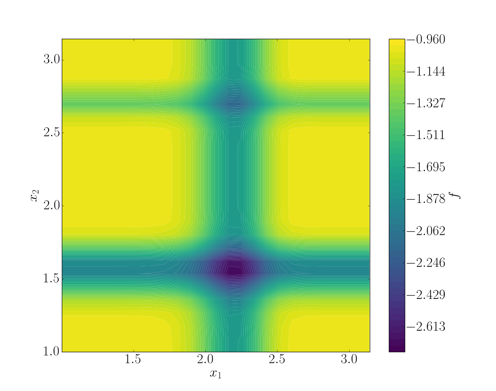
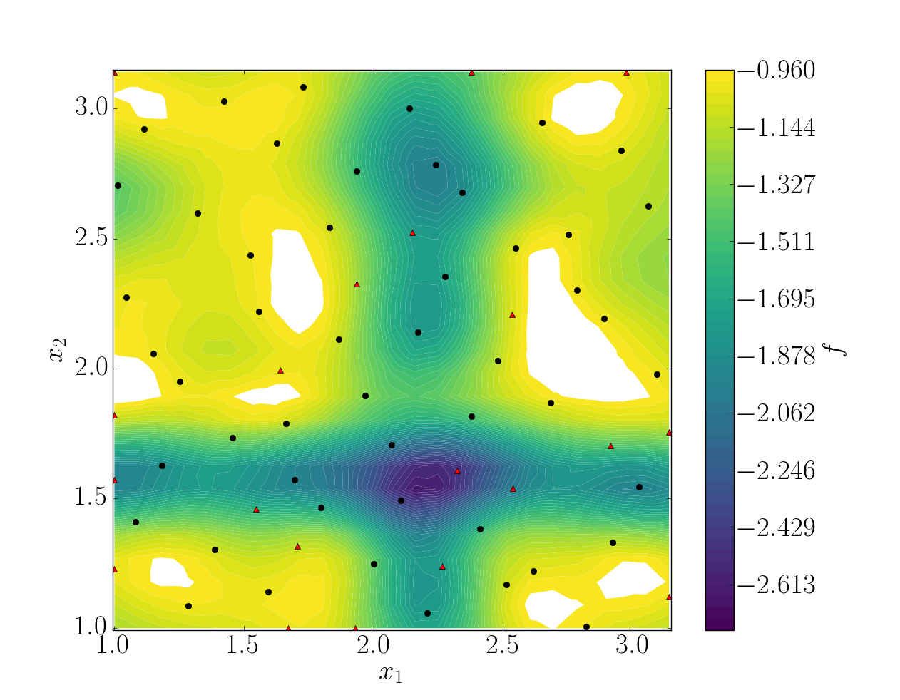
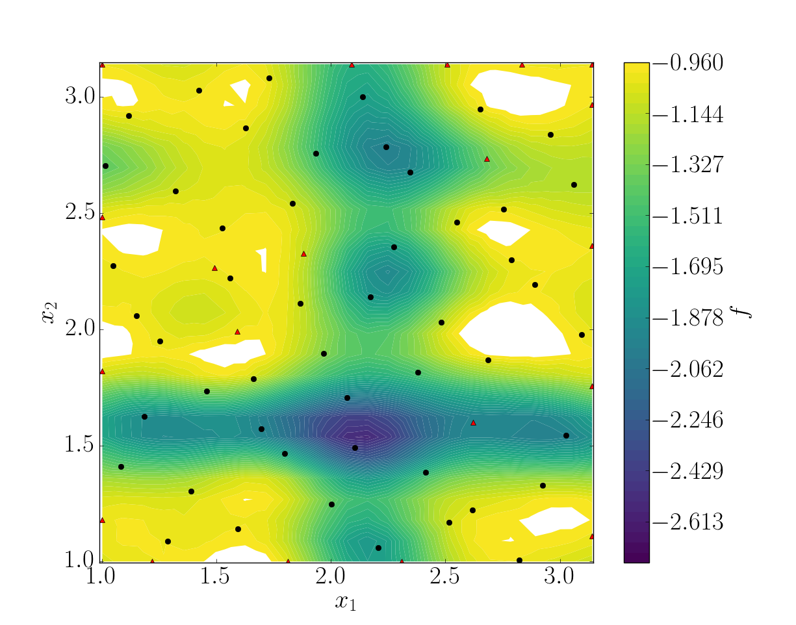

.. _tutorial:

Tutorial
========

Introduction
------------

Examples can be found in JPOD's installer subrepository ``test-cases``. To create a new study, you have to keep the same structure as this example on the *Michalewicz* function:

.. code::

    Michalewicz
    |
    ├__ data
    |   |
    |   ├__ function.py
    |
    ├__ scripts
        |
        ├__ settings_template.py
        |
        ├__ task.py

The working directory consists of two directories: 

+ ``data``: contains all the simulation files necessary to perform a new simulation. It can be a simple python script to a complex *AVBP* case. The content of this directory will be copied for each snapshot.

+ ``scripts``: contains the python setup files.

.. note:: The following section is a step-by-step tutorial that can be applied to any case. All compulsory keywords are here.

.. seealso:: Find more details on every keywords in :ref:`settings` section.

JPOD step-by-step
-----------------

Step 1: Simulation directory
............................

Michalewicz function
""""""""""""""""""""

For this tutorial, the `Michalewicz function <http://www.sfu.ca/~ssurjano/michal.html>`_ was choosen. It is a multimodal *d*-dimensional function which has :math:`d!` local minima - for this *test-case*: 

.. math:: f(x)=-\sum_{i=1}^d \sin(x_i)\sin^{2m}\left(\frac{ix_i^2}{\pi}\right),

where *m* defines the steepness of the valleys and ridges.

.. note:: + It is to difficult to search a global minimum when :math:`m` reaches large value. Therefore, it is recommended to have :math:`m < 10`.
          + In this case we used the two-dimensional form, i.e. :math:`d = 2`. 

To summarize, we have the Michalewicz 2*D* function as follows:

.. math:: f(x)=-\sin(x_1)\sin^{20}\left(\frac{x_1^2}{\pi}\right)-\sin(x_2)\sin^{20}\left(\frac{2x_2^2}{\pi}\right).

.. image:: fig/response_Michalewicz_true_3D.png

.. seealso:: For other *optimization functions*, read more at `this website <http://www.sfu.ca/~ssurjano/optimization.html>`_.

Create the case for JPOD
""""""""""""""""""""""""

For each snapshot, JPOD will copy the content of ``data`` and add a new folder ``jpod-data`` which contains a single file ``header.py``. The content of this file is updated per snapshot and it only contains the input parameters to change for the current simulation. Hence, to use Michalewicz's function with JPOD, we need to have this file read to gather input parameters.

Aside from the simulation code and this headers, there is a ``data/script.sh``. It is this script that is launched by JPOD. Once it is completed, the computation is considered as finished. Thus, this script manages an AVBP launch, calls a python script, etc.

In the end, the quantity of interest has to be written in tecplot format within the repository ``cfd-output-data``.

.. note:: These directories' name and path are fully configurables.

Step 2: Setting up the case
...........................

JPOD's settings are managed via a python file located in ``scripts``. An example template can be found within all examples directory. This file consists in five blocks with different functions:

Block 1 - Space of Parameters
"""""""""""""""""""""""""""""

The space of parameters is created using the two extrem points of the domain here we have :math:`x_1, x_2 \in [1, \pi]^2`. Also we want to make 20 snapshots using a halton sequence.

.. code-block:: python

    space = {'corners'     : ((1., 1.), (3.1415, 3.1415),),
             'delta_space' : 0.01,                         
             'size_max'    : 50,
             'provider'    : {'method' : 'halton',
                              'size'   : 50,
                             }
            }

Block 2 - Snapshot provider
"""""""""""""""""""""""""""

Then, we configure the snapshot itself. We define the name of the header and output file as well as the dimension of the output. Here JPOD will look at the variable ``F``, which is a scalar value, within the file ``function.dat``.

.. code-block:: python

     snapshot = {'max_workers' : 2,
                 'io'          : {
                    'parameter_names'    : ['x1','x2'],
                    'format'             : 'fmt_tp',
                    'filenames'          : {0: ['function.dat']},
                    'point_filename'     : 'header.py',
                    'template_directory' : None,
                    'variables'          : ['F'],
                    'shapes'             : {0: [(1,)]},
                                 },
                }

Block 3 - POD
"""""""""""""

After that, we can control the quality of the resulting POD, chose a re-sampling strategy, etc.

.. code-block:: python

     pod = {'tolerance' : 0.99,
            'dim_max'   : 100,
            'type'      : 'static',
            'resample'  : None,
            'strategy'  : (('MSE', 4),),
            'quality'   : 0.8,
            'server'    : None,
           }

Block 4 - Prediction
""""""""""""""""""""

A model is build on POD's matrices to approximate a new snapshot. The Kriging method is selected. To construct a response surface, we need to make predictions. Here a 25x25 snapshots grid will be predicted.

.. code-block:: python

    prediction = {'method' : 'kriging',
                  'points' : [],
                 }

    import numpy as np
    import itertools
    num = 25
    x = np.linspace(space['corners'][0][0], space['corners'][1][0], num=num)
    y = np.linspace(space['corners'][0][1], space['corners'][1][1], num=num)
    for i, j in itertools.product(x, y):
        prediction['points'] += [(float(i),float(j))]

Block 5 - UQ
""""""""""""

Once the model has been created, it can be used to perform a statistical analysis. Here, Sobol' indices are computed using Sobol's method using 50000 samples. 

.. code-block:: python

    uq = {'method' : 'sobol',
          'type'   : 'aggregated',
          'sample' : 50000,
          'pdf'    : ['Uniform(1., 3.1415)',
                      'Uniform(1., 3.1415)']
         }

Step 3: Running JPOD
....................

To launch JPOD, simply call it with::

    jpod scripts/tasks.py -qsu

JPOD's log are found within ``JPOD.log``. Here is an extract:: 

    JPOD main ::
        POD summary:
        modes filtering tolerance    : 0.99
        dimension of parameter space : 2
        number of snapshots          : 50
        number of data per snapshot  : 1
        maximum number of modes      : 100
        number of modes              : 1
        modes                        : [ 2.69091785]
    jpod.pod.pod ::
        pod quality = 0.45977, max error location = (3.0263943749999997, 1.5448927777777777)

    ----- Sobol' indices -----
    jpod.uq ::
        Second order: [array([[ 0.        ,  0.06490131],
           [ 0.06490131,  0.        ]])]
    jpod.uq ::
        First order: [array([ 0.43424729,  0.49512012])]
    jpod.uq ::
        Total: [array([ 0.51371718,  0.56966205])]

In this example, the quality of the model is estimated around :math:`Q_2\sim 0.46` which means that the model is able to represents around 46% of the variability of the quantity of interest. Also, from Sobol' indices, both parameters appears to be as important.

Post-treatment
..............

Result files are separated in 4 directories under ``output``::

     Case
     |
     |__ data
     |
     |__ scripts
     |
     |__ output
         |
         |__ pod
         |
         |__ predictions
         |
         |__ snapshots
         |
         |__ uq

``snapshots`` contains all snapshots computations, ``predictions`` contains all predictions and ``uq`` contains the statistical analysis. Using predictions we can plot the response surface of the function as calculated using the model:

.. image:: fig/response_Michalewicz_model_2D.png

It can be noted that using 50 snapshots on this case is not enought to capture all the non-linearities of the function.

.. note:: Physical phenomena usualy are smoother. Thus, less points are needed for a 2 parameters problem when dealing with real physics.

Refinement strategies
.....................

In this case, the error was fairly high using 50 snapshots. A computation with 40 snapshots using 10 refinement points have been compared to the initial sampling. To use this functionnality, the POD block has been changed in order to use a mean square strategy:

.. code-block:: python

     pod = {'tolerance' : 0.99,
            'dim_max'   : 100,
            'type'      : 'static',
            'resample'  : 'loo_mse',
            'strategy'  : (('MSE', 4),),
            'quality'   : 0.8,
            'server'    : None,
           }

The first block has to be modified also: 

.. code-block:: python

    space = {'corners'     : ((1., 1.), (3.1415, 3.1415),),
             'delta_space' : 0.01,                         
             'size_max'    : 70,
             'provider'    : {'method' : 'halton',
                              'size'   : 50,
                             }
            }

This block tells JPOD to compute a maximum of 10 resampling snapshots in case the quality has not reach 0.8. This ``loo_mse`` strategy uses the information of the model error provided by the gaussian process regression. This leads to an improvement in the error with :math:`Q_2 \sim 0.71`.

   
   Response surface interpolation using 50 snapshots and 20 refined points,
   represented by the red triangles.

Using a basic ``MSE`` technique with again 20 new snapshots, the error is :math:`Q_2 \sim 0.60`.

In this case, the first method performed better but this is highly case dependent. 
