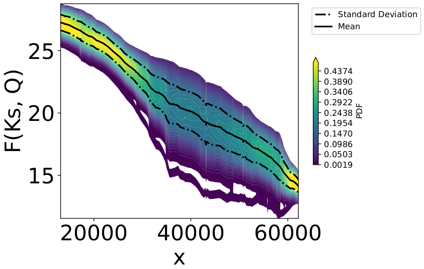

.. _applications:

Mascaret software for hydraulic modelling
=========================================

This section presents the use of BATMAN for uncertainty quantification in the case of hydraulic modelling. Firstly, scientific notions relative to this domain are introduced. Then, different simple test cases are described through the setting files associated with a dedicated software and the UQ treatment is prescribed in the BATMAN setting file. BATMAN is also used for a real study case based on the Garonne river with a consistent part associated with visualization. Lastly, an API developed for this software in order to lead UQ study is presented.

.. note::

    The following test cases require the installation of the MASCARET software and the corresponding API which are not included in the BATMAN library. Visit the website http://www.opentelemac.org to get them.

1. The hydraulic model
----------------------

Free surface flow dynamics in rivers are well modeled by the Navier-Stokes equations (NSE). When the vertical dimension is supposed to be significantly smaller than the horizontal dimensions and when the bathymetry variations are supposed to be small, the shallow-water equations (SWE) can be derived from the NSE, by means of their vertical integration  under  the hydrostatic pressure assumption. The SWE form a hyperbolic system of partial differential equations, which represents sub-critical and supercritical flows with hydraulic jumps. In the present work, only sub-critical flows of rivers in plains are considered, consistently with the hydraulic model used at operational level for the Garonne river.

One-dimensional models are widely used in hydraulic engineering, for instance in flood forecasting. One-dimensional SWE are derived from two prime principles: mass conservation and momentum conservation. For most applications in rivers, the equations are written in terms of discharge (or flow rate) :math:`Q` :math:`[\text{m}^3.\text{s}^{-1}]` and hydraulic section :math:`A` :math:`[\text{m}^2]` that relates to water level (or water height) :math:`h` :math:`[\text{m}]` such that :math:`A \equiv A(h)`. The curvilinear abscissa in the simulation domain is denoted by :math:`s` ranging from :math:`s_\text{in}` upstream of the river to :math:`s_\text{out}` downstream. Thus, the non-conservative form of the one-dimensional SWE reads:

.. math::

   \Biggl \lbrace
   {
      \partial_t A(h)+\partial_s Q = 0
      \atop
      \partial_t Q + \partial_s\left(Q(h)^2/A(h)\right)+gA(h)\partial_s h - gA(h)\left(S_0-S_f\right)=0
   }

with :math:`g~[\text{m}.\text{s}^{-2}]` the gravity, :math:`S_0` the channel slope and :math:`S_f` the friction slope. These equations are usually combined with an equation for the friction slope :math:`S_f`, here described by the Manning-Strickler formula: :math:`S_f=Q^2K_S^{-2}A(h)^{-2}R(h)^{-4/3}` where :math:`R(h)=A(h)/P(h)` is the hydraulic radius written as a function of the wet perimeter :math:`P(h)` and :math:`K_S~[\text{m}^{1/3}.\text{s}^{-1}]` is the Strickler friction coefficient.

2. Uncertainty quantification for the MASCARET software
-------------------------------------------------------

In the present application, the MASCARET software is used to simulate the one-dimensional SWE, i.e. the water level :math:`h` and discharge :math:`Q` over the discrete hydraulic network for :math:`s\in[s_{\text{in}},s_{\text{out}}]`. This simulator is commonly used for dam-break wave simulation, reservoir flushing and flooding.  The hydraulic model requires the following input parameters: bathymetry, upstream and downstream boundary conditions, lateral inflows, roughness coefficients and initial condition for the hydraulic state :math:`(h,Q)`. 

Some references:

- *A Finite Volume Solver for 1D Shallow-Water Equations Applied to an Actual River*, N. Goutal and F. Maurel, Int. J. Numer. Meth. Fluids 2002; 38:1-19
- *MASCARET: a 1-D Open-Source Software for Flow Hydrodynamic and Water Quality in Open Channel Networks*, N. Goutal, J.-M. Lacombe, F. Zaoui and K. El-Kadi-Abderrezzak, River Flow 2012 – Murillo (Ed.), pp. 1169-1174
- Website: http://www.opentelemac.org/index.php/presentation?id=138

In practice, even if the input parameters are set at believable values, some uncertainties remain concerning these choices and turn into uncertainty in the simulated hydraulic state. Analyzing this hydraulic state variability through uncertainty quantification, notably in view of the input ones through sensitivity analysis, is of prime importance e.g. in a risk analysis framework or a data assimilation system.

In what follows, we apply the BATMAN library to an academic test case (a rectangular open channel) and a real hydraulic model (a section of the Garonne river).

3. Test cases for a rectangular open channel
--------------------------------------------

We consider a simple rectangular open channel with the following features:

- length: :math:`5~\text{km}`
- space step: :math:`100~\text{m}`
- maximal time: :math:`1~\text{h}`
- Strickler coefficient: :math:`30.59~\text{m}^{1/3}.\text{s}^{-1}`
- upstream flow: :math:`1000~\text{m}^3.\text{s}^{-1}`
- downstream height: :math:`12.5~\text{m}`

We design different test cases using the user configuration file ``config_canal_user_{TestCaseName}.json`` required by the Mascaret API. The common features are:

- ``"Q_cst": 0.0`` in ``"init_cst"``: initial flow rate set to :math:`0~\text{m}^3.\text{s}^{-1}` everywhere;
- ``"Z_cst": 10.0`` in ``"init_cst"``: initial water level set to :math:`10~\text{m}` everywhere;
- ``"info_bc": true`` in ``"misc"``: print information concerning the boundary conditions;
- ``"all_outstate": true`` in ``"misc"``: return the water level at each node.

The uncertain parameters are the Strickler coefficient :math:`K_S` and the upstream flow rate :math:`Q_{\text{up}}`, and sometimes the bathymetry.

3.1. Test case #1: simple configuration
'''''''''''''''''''''''''''''''''''''''

Source: ``./tests_cases/Mascaret/INPUTS/examples_config_canal/config_canal_user_simple.json``

This test case is simply defined by the common features.

.. code-block:: python

    {
        "init_cst": {
            "Q_cst": 0.0,
            "Z_cst": 10.0
        },
        "misc": {
            "info_bc": true,
            "all_outstate": true,
            "index_outstate": 25
        }
    }

3.2. Test case #2: change :math:`K_S` and :math:`Q_{\text{up}}`
'''''''''''''''''''''''''''''''''''''''''''''''''''''''''''''''

Source: ``./tests_cases/Mascaret/INPUTS/examples_config_canal/config_canal_user_KsQ.json``

This test case changes the predefined values of :math:`K_S` and :math:`Q_{\text{up}}` and is defined as follows:

- the Strickler coefficient :math:`K_S` (``"Ks": {}``) is set to :math:`25.0~\text{m}^{1/3}.\text{s}^{-1}` (``"value": 25.0``) for the zone (``"zone": true``) index 0 (``"ind_zone": 0``);
- the upstream flow rate :math:`Q_{\text{up}}` (``"Q_BC": {}``) is set to :math:`2345~\text{m}^{3}.\text{s}^{-1}` (``"value": 2345.0``) for the zone index 0 (``"idx: 0``).

.. code-block:: python

    {
        "init_cst": {
            "Q_cst": 0.0,
            "Z_cst": 10.0
        },
        "Q_BC": {
            "idx": 0,
            "value": 2345.0
        },
        "Ks": {
            "zone": true,
            "value": 25.0,
            "ind_zone": 0
        },
        "misc": {
            "info_bc": true,
            "all_outstate": true
        }
    }

3.3. Test case #3: change the bathymetry uniformly
''''''''''''''''''''''''''''''''''''''''''''''''''

Source: ``./tests_cases/Mascaret/INPUTS/examples_config_canal/config_canal_user_bathy.json``

This test case changes the predefined value of the bathymetry (``"bathy": {}``) and is defined as follows: 

- all bathymetry sections are modified (``"all_bathy": true``);
- the increase is set to :math:`2~\text{m}` (``"dz": 2.0``) at each section.

.. code-block:: python

    {
        "init_cst": {
            "Q_cst": 0.0,
            "Z_cst": 10.0
        },
        "bathy": {
            "all_bathy": true,
            "dz": 2.0
        },
        "misc": {
            "info_bc": true,
            "all_outstate": true
        }
    }

3.4. Test case #4: change the bathymetry non-uniformly
''''''''''''''''''''''''''''''''''''''''''''''''''''''

Source: ``./tests_cases/Mascaret/INPUTS/examples_config_canal/config_canal_user_bathyLp.json``

This test case changes the predefined value of the bathymetry (``"bathy": {}``) and is defined as follows: 

- all bathymetry sections are modified (``"all_bathy": true``)
- the variation is defined by a centered Gaussian process with a squared exponential kernel (use of ``"Lp"``);
- the correlation length of the Gaussian process is set to :math:`222~\text{m}` (``"Lp": 222.0``);
- the standard deviation of the Gaussian process is set to :math:`2~\text{m}` (``"dz": 2.0``).

.. code-block:: python

    {
        "init_cst": {
            "Q_cst": 0.0,
            "Z_cst": 10.0
        },
        "bathy": {
            "all_bathy": true,
            "dz": 2.0,
            "Lp": 222.0
        },
        "misc": {
            "info_bc": true,
            "all_outstate": true
        }
    }

3.5. BATMAN setting file for these test cases
'''''''''''''''''''''''''''''''''''''''''''''

3.5.a. Input parameter space
******************************

**Test cases #1, #2 and #3**

Sources:

- ``./tests_cases/Mascaret/INPUTS/examples_settings_canal/settings_KsQ.json`` (UQ-Mascaret)
- ``./tests_cases/Mascaret/INPUTS/examples_settings_canal/settings_kriging_KsQ.json`` (UQ-Kriging)
- ``./tests_cases/Mascaret/INPUTS/examples_settings_canal/settings_PC_KsQ.json`` (UQ-PCE)

We define the input parameters:

- :math:`K_{S_3}\in[20.0, 40.0]`,
- :math:`Q_{\text{up}}\in[1000.0, 3000.0]`.

We suppose that:

- :math:`K_{S_3}` follows an uniform distribution over :math:`[20.0, 40.0]`,
- :math:`Q_{\text{up}}` follows a Beta distribution over :math:`[20.0, 40.0]` with mean set to 2000 and standard deviation set to 500.

.. code-block:: python

    "space": {
        "corners": [
            [20.0, 1000.0], 
            [40.0, 3000.0]
        ],
        "sampling": {
            "init_size": 120,
            "method": "saltelli",
            "distributions": [
                "Uniform(20., 40.)", 
                "BetaMuSigma(2000, 500, 1000, 3000).getDistribution()"
            ]
        }
    }

**Test case #4**

Source: ``./tests_cases/Mascaret/INPUTS/examples_settings_canal/settings_bathy.json``

We only consider the bathymetry as input parameter. We do not specify a probability distribution for the bathymetry because by definition, the bathymetry is a Gaussian process defined by the configuration file ``config_canal_user_bathyLp.json``.  We want to make 5 snapshots using a Halton sequence.

.. code-block:: python

    "space": {
        "corners": [
            [999.0, 999.0], 
            [9999.0, 9999.0]
        ],
        "sampling": {
            "init_size": 5,
            "method": "halton"
        }
    }

3.5.b. Snapshot provider
************************

We configure the snapshot provider itself. We specify that no more than ``5`` can be simultaneous run. We define the name of the header and output file as well as the dimension of the output. Here BATMAN will look at the variable ``"F"``, which is a vector of size ``51``, within the file ``function.dat``. It corresponds to the values of the input parameter ``"x1"`` and ``"x2"`` stored in the file ``"header.py"``. The BASH script file of the provider is ``"script.sh"`` and is situated in the directory ``"data"``. The input values are stored in the directory ``"batman-data"`` and the input-output snapshots are stored in the directory ``"cfd-output-data"``. 

.. code-block:: python

    "snapshot": {
        "max_workers": 5,
        "plabels": ["x1", "x2"],
        "flabels": ["X", "F"],
        "io": {
            "point_filename": "point.json",
            "data_filename": "point.dat",
            "data_format": "fmt_tp_fortran"
        },
        "provider": {
            "type": "file",
            "context_directory": "data",
            "coupling_directory": "batman-coupling",
            "command": "bash script.sh",
            "clean": false
        }
    }

The BASH script file of the provider calls the Python file ``function.py``.

.. code-block:: bash

    #!/bin/sh

    python function.py > function.out

The Python file ``function.py`` creates an instance of the class ``MascaretApi`` which depends of the configuration test case file (here ``'config_garonne_lnhe.json'``) and configuration user file (``'config_garonne_lnhe_user.json'``). Then, it reads the input parameter values stored in ``'./batman-data/header.py'`` and makes a conversion to floating format. The Mascaret software is run with these input parameter values using the function ``__call__`` of the class ``MascaretApi``. The water level ``F`` is printed and plotted. Lastly, the input-output snapshot is stored in ``./cfd-output-data/function.dat``.

.. code-block:: python

    #!/usr/bin/env python
    # coding:utf-8
    
    import re
    import json
    import numpy as np
    import ctypes
    import csv
    from batman.input_output import (IOFormatSelector, Dataset)
    from batman.functions import MascaretApi
        
    study = MascaretApi('config_garonne_lnhe.json','config_garonne_lnhe_user.json')  
    
    # Input from header.py
    with open('./batman-coupling/point.json', 'r') as fd:
        params = json.load(fd)
    
    X1 = params['x1']
    X2 = params['x2']
    
    X1 = float(X1)
    X2 = float(X2)
    
    # Function
    X, F = study(x=[X1, X2])
    
    # Output
    nb_value = np.size(X)
    with open('./batman-coupling/point.dat', 'w') as f:
        f.writelines('TITLE = \"FUNCTION\" \n')
        f.writelines('VARIABLES = \"X\" \"F\"  \n')
        f.writelines('ZONE T=\"zone1\" , I=' + str(nb_value) + ', F=BLOCK  \n')
        for i in range(len(X)):
            f.writelines("{:.7E}".format(float(X[i])) + "\t ")
            if i % 1000:
                f.writelines('\n')
        f.writelines('\n')
    
        for i in range(len(F)):
            f.writelines("{:.7E}".format(float(F[i])) + "\t ")
            if i % 1000:
                f.writelines('\n')
            f.writelines('\n')

3.5.c. Data visualization
*************************

The design of experiments is not plotted (``"doe": false``). ``5`` ticks are used on the colorbar. The cost function is labeled ``"F(Ks, Q)"``. The curvilinear abscissa associated with the output components are stored in ``"xdata"`` (from 0 to 5 km with interval set to 100 m). This optionnal block provides a response surface of the water level ``"F"`` in function of the input parameter ``"Ks"`` and ``"Q"``.

.. code-block:: python

    "visualization": {
        "doe": false,
        "xdata": [0.0, 100.0, 200.0, 300.0, 400.0, 500.0, 600.0, 700.0, 800.0, 900.0, 1000.0, 1100.0, 1200.0, 1300.0, 1400.0, 1500.0, 1600.0, 1700.0, 1800.0, 1900.0, 2000.0, 2100.0, 2200.0, 2300.0, 2400.0, 2500.0, 2600.0, 2700.0, 2800.0, 2900.0, 3000.0, 3100.0, 3200.0, 3300.0, 3400.0, 3500.0, 3600.0, 3700.0, 3800.0, 3900.0, 4000.0, 4100.0, 4200.0, 4300.0, 4400.0, 4500.0, 4600.0, 4700.0, 4800.0, 4900.0, 5000.0],
        "ticks_nbr": 5,
        "flabel": "F(Ks, Q)"
    }

3.5.d. Uncertainty quantification
*********************************

We compute the ``"aggregated"`` ``"Sobol"`` indices based on a sample of size ``1200`` with the distributions:

- uniform distribution over :math:`[20.0, 40.0]` for :math:`K_{S_3}`,
- Beta distribution over :math:`[20.0, 40.0]` with mean set to 2000 and standard deviation set to 500 for :math:`Q_{\text{up}}`.

.. code-block:: python

    "uq": {
        "sample": 1200,
        "pdf": [
            "Uniform(20., 40.)",
            "BetaMuSigma(2000, 500, 1000, 3000).getDistribution()"
        ],
        "type": "aggregated",
        "method": "sobol"
    }

4. Test case for the Garonne river between Tonneins and La Réole
----------------------------------------------------------------

We also consider a real hydraulic network over the Garonne river in France.  The  Garonne  river  flows  from  the  Pyrenees  to  the  Atlantic  Ocean in the area of Bordeaux. It is approximately :math:`647-\text{km}` long and drains an area of :math:`55'000~\text{km}^2`. The present study focuses on a :math:`50-\text{km}` reach from Tonneins (:math:`s = 13~\text{km}`) to La R\'eole (:math:`s = 62~\text{km}`) with an observation station at Marmande (:math:`s = 36~\text{km}`). The mean slope over the reach is :math:`S_0=3.3~\text{m}.\text{km}^{-1}` and the mean width of the river is :math:`W=250~\text{m}`. The  bank-full  discharge  is  approximately  equal  to  the  mean  annual discharge (:math:`Q_0=1'000~\text{m}^3.s^{-1}`). Despite the existence of active floodplains, this reach can be modeled accurately by a 1-D hydraulic model.

The  hydraulic  model  for  the  the  Garonne  River  is  built  from  83  on-site bathymetry cross sections from which the full 1D bathymetry is interpolated. Friction is prescribed over 3 portions for the river channel and the floodplain; it is represented by the Strickler coefficients :math:`K_{S_1},K_{S_2},K_{S_3}`. It should be noted that Marmande is located at the beginning of the :math:`K_{S_3}` portion. The upstream boundary condition is prescribed with an unsteady flow :math:`Q_{\text{up}}(t)`; the downstream boundary condition is prescribed with a local rating curve established at La R\'eole that sets :math:`h(s_{\text{out}})=h_{\text{out}}`.  The  hydraulic  model  has  been  calibrated using channel and floodplain roughness coefficients as free parameters.

4.1. Description of the test case
'''''''''''''''''''''''''''''''''

Source: ``./tests_cases/Mascaret/INPUTS/examples_config_garonne/config_garonne_lnhe_user_KsQ.json``

This test case changes the predefined values of :math:`K_{S_3}` and :math:`Q_{\text{up}}` and is defined as follows:

- the Strickler coefficient :math:`K_S` (``"Ks": {}``) is set to :math:`32.0~\text{m}^{1/3}.\text{s}^{-1}` (``"value": 32.0``) for the zone (``"zone": true``) index 2 (``"ind_zone": 2``);
- the upstream flow rate :math:`Q_{\text{up}}` (``"Q_BC": {}``) is set to :math:`2345~\text{m}^{3}.\text{s}^{-1}` (``"value": 2345.0``) for the zone index 0 (``"idx: 0``).

We print information concerning the boundary conditions (``"info_bc": true``) and consider the water level at each space step (``"all_outstate": true``).

.. code-block:: python

    {
        "Q_BC": {
            "idx": 0,
            "value": 2345.0
        },
        "Ks": {
            "zone": true,
            "value": 32.0,
            "ind_zone": 2 
        },
        "misc": {
            "info_bc": true,
            "all_outstate": true
        }
    }

4.2. Parametrizing the BATMAN settings file for a UQ study
**********************************************************

We can also realize a UQ study using the JSON settings file. For the Garonne test case, the sources of uncertainty are :math:`Q` and :math:`K_{S_3}` and their probabilistic distributions are described from expert knowledge. Both Strickler coefficient :math:`K_{S_3}` and bank-full discharge :math:`Q_{\text{up}}` follow uniform distributions and are supposed to be independent:

+--------------+----------------------------------------+----------------------------------------+
|              | :math:`K_{S_3}`                        | :math:`Q_{\text{up}}`                  |
+==============+========================================+========================================+
| Distribution | Uniform(:math:`\text{min},\text{max}`) | Normal(:math:`\text{mean},\text{std}`) |
+--------------+----------------------------------------+----------------------------------------+
| Parameter #1 | :math:`\text{min}=15`                  | :math:`\text{mean}=4031`               |
+--------------+----------------------------------------+----------------------------------------+
| Parameter #2 | :math:`\text{max}=60`                  | :math:`\text{std}=400`                 |
+--------------+----------------------------------------+----------------------------------------+

Goal:

#. Build a design of experiments
#. Build a surrogate model from this design of experiments
#. Evaluate the Sobol' indices associated to the variables :math:`Q_{\text{up}}` and :math:`K_{S_3}`

Source: ``./tests_cases/Mascaret/INPUTS/examples_settings_garonne/settings_PC_KsQ_gauss.json``

To run these tasks, go to the directory ``./test_cases/Mascaret/``. and use the commande line:

.. code:: bash

    ./install_links_run_mascaret_garonne_lnhe
    cp INPUTS/examples_settings_garonne/settings_PC_KsQ_gauss.json .
    batman settings_PC_KsQ_gauss.json -uq

where:

- ``settings_PC_KsQ_gauss.json`` is the path of the settings file,
- ``u`` is the option for carrying out an uncertainty quantification study,
- ``q`` is the option for estimating  Q2 and finding the point with max MSE.

.. _MascaretDOE:

4.2.1. Design of experiments
****************************

.. code-block:: python
   
    "space": {
        "corners": [
            [15.0, 1000.0],
            [60.0, 6000.0]
        ],
        "sampling": {
            "init_size": 121,
            "method": "halton",
            "distributions": ["Uniform(15., 60.)", "Normal(4031, 400)"]
        }
    }

We define a design of experiments where:

- the lower bounds of :math:`(K_{S_3},Q_{\text{up}})` are ``[15.0, 1000.0]``,
- the upper bounds of :math:`(K_{S_3},Q_{\text{up}})` are ``[60.0, 6000.0]``,
- the design method is ``Halton`` sequencing,
- the sample size is equal to ``121``,
- the distribution of :math:`K_{S_3}` is ``"Uniform(15., 60.)"``,
- the distribution of :math:`Q_{\text{up}}` is ``"Normal(4031, 400)"``,

.. _MascaretSnapshots:

4.2.2. Generation of snapshots
******************************

We configure the snapshot provider itself. We specify that no more than ``5`` can be simultaneous run. We define the name of the header and output file as well as the dimension of the output. Here BATMAN will look at the variable ``"F"``, which is a vector of size ``463``, within the file ``function.dat``. It corresponds to the values of the input parameter ``"x1"`` and ``"x2"`` stored in the file ``"header.py"``. The BASH script file of the provider is ``"script.sh"`` and is situated in the directory ``"data"``. The input values are stored in the directory ``"batman-data"`` and the input-output snapshots are stored in the directory ``"cfd-output-data"``.

.. code-block:: python

    "snapshot": {
        "max_workers": 5,
        "plabels": ["x1", "x2"],
        "flabels": ["X", "F"],
        "io": {
            "point_filename": "point.json",
            "data_filename": "point.dat",
            "data_format": "fmt_tp_fortran"
        },
        "provider": {
            "type": "file",
            "context_directory": "data",
            "coupling_directory": "batman-coupling",
            "command": "bash script.sh",
            "clean": false
        }
    }

.. _MascaretSurrogateModel:

4.2.3. Surrogate model
**********************

Based on the snapshot sample obtained from the previous steps (see :ref:`MascaretDOE` and :ref:`MascaretSnapshots`), we define a metamodel with the following features:

- the type is a polynomial chaos expansion (PCE): ``"method": "pc"``,
- the PCE weights are estimated by truncation: ``"strategy": "Quad"``,
- the total polynomial degree is fixed to 10: ``"degree": 10``.

and make ``"predictions"`` for the following :math:`(K_{S_3}, Q_{\text{up}})` values of ``[[30, 2000]]``.

.. code-block:: python

    "surrogate": {
        "predictions": [[30, 2000]],
        "method": "pc",
        "strategy": "Quad",
        "degree": 10
    },

4.2.4. Uncertainty quantification
*********************************

In the UQ study, we use the PCE metamodel instead of the Mascaret simulator which is too CPU-time expensive. Based on the computational technique called ``"aggregated"``, we estimate the ``"Sobol"``' indices associated with the Strickler coefficient :math:`K_{S_3}` whose distribution is ``"Uniform(15., 60.)"`` and the flow rate :math:`Q_{\text{up}}` whose distribution is ``"Normal(4031, 400)"`` using a sample whose size is equal to ``50000``.

.. code-block:: python

    "uq": {
        "sample": 50000,
        "pdf": ["Uniform(15., 60.)", "Normal(4031, 400)" ],
        "type": "aggregated",
        "method": "sobol"
    }

4.2.5. Visualization
********************

The design of experiments is not plotted (``"doe": false``). ``5`` ticks are used on the colorbar. The cost function is labeled ``"F(Ks, Q)"``. The curvilinear abscissa associated with the output components are stored in ``"xdata"`` (from 13.150 km to 62.175 km). This optionnal block provides a response surface of the water level ``"F"`` in function of the input parameter ``"Ks"`` and ``"Q"``.

.. code-block:: python

    "visualization": {
        "doe": false,
        "xdata": [13150.0, 13250.0, 13350.0, ..., 62056.25, 62175.0],
        "ticks_nbr": 5,
        "flabel": "F(Ks, Q)"
    }

4.3. Examples of figures
''''''''''''''''''''''''

**Design of experiments:**

Plot of the design of experiments with the empirical distribution (:math:`x_0` corresponds to the input parameter :math:`K_{S_3}` and :math:`x_1`  corresponds to the input parameter :math:`Q`).

**Water level for the first snapshot** 

Plot of the water level (blue line) and flow rate (red line) at final simulation time along the open-channel. The bathymetry is plotted in dark.

**3D Kiviat plot**

Representing the 120-sample by means of a 3D Kiviat where the output is represented by a surface whose colour corresponds to the value and extremities corresponds to the input values.

.. image:: ../fig/applications/myKiviat_Garonne_Ens120.png

**Output probability density function**

Plot of the probability density function of the water level evaluated at each spatial point.

**Highest density region plot**

Plot of the highest density region plot of the water level where the black line represents the median, both gray areas represent the 50\% and 90\% confidence intervals and the dashed lines represent the outliers present in the dataset.

**Output covariance plot**

Plot of the covariance of the water level at the different spatial points.

**Output correlation plot**

Plot of the correlation of the water level at the different spatial points.

**Aggregated Sobol' indices**

Plot of the Sobol' indices associated to  the input parameters :math:`K_{S_3}` (here denoted :math:`x_1`) and :math:`Q` (here denoted :math:`x_2`), with a confidence interval symbolized by a black segment.

**Regionalized Sobol' indices**

Plot of regionalized the Sobol' indices associated to  the input parameters :math:`K_{S_3}` (here denoted :math:`x_1`) and :math:`Q` (here denoted :math:`x_2`). We can see that these sensitivity change along the river.

   

5. Use of the Mascaret API
--------------------------

Source: ``./tests_cases/Mascaret/test_run.py``

5.1. Import packages and functions
''''''''''''''''''''''''''''''''''

.. code-block:: python

	import ctypes
	import csv
	import numpy as np
	import os
	from collections import OrderedDict 
	from batman.functions import MascaretApi
	from batman.functions.telemac_mascaret import print_statistics, histogram, plot_opt

5.2. Read the MascaretApi documentation
'''''''''''''''''''''''''''''''''''''''

.. code-block:: python

	# Details about MascaretApi
	help(MascaretApi)

5.3. List the different test cases
''''''''''''''''''''''''''''''''''

.. code-block:: python

	# Create the dictionary of model and user config files
	files = OrderedDict()
	# -- CANAL
	files["canal", "model"] = 'config_canal.json'
	files["canal", "user"] = 'config_canal_user.json'
	files["canal", "install"] = './install_links_run_mascaret_canal'
	# -- GARONNE_LNHE
	files["garonne_lnhe", "model"] = 'config_garonne_lnhe.json'
	files["garonne_lnhe", "user"] = 'config_garonne_lnhe_user.json'
	files["garonne_lnhe", "install"] = './install_links_run_mascaret_garonne_lnhe'
	# -- GARONNE_LNHE_CASIER
	files["garonne_lnhe_casier", "model"] = 'config_garonne_lnhe_casier.json'
	files["garonne_lnhe_casier", "user"] = 'config_garonne_lnhe_casier_casier.json'
	files["garonne_lnhe_casier", "install"] = './install_links_run_mascaret_garonne_lnhe_casier'
	# -- ADOUR
	files["adour", "model"] = 'config_adour.json'
	files["adour", "user"] = 'config_adour_user.json'
	files["adour", "install"] = './install_links_run_mascaret_adour'

5.4. Select and install the test case environment
'''''''''''''''''''''''''''''''''''''''''''''''''

.. code-block:: python

	# Let the user to select one of these test cases
	i = 0
	for i in range(len(files) / 3):
	    print('- Test case #{}: {}'.format(i+1, files.keys()[i*3][0]))
	id_test_case = input('Select one of these test cases (index)... ')
	test_case = files.keys()[(int(id_test_case)-1)*3][0]
	print('- Your selected test case: {}'.format(test_case))

	# Install the environment corresponding to this test case
	os.system(files[test_case, "install"])

5.5. Build the corresponding Mascaret model and print information
'''''''''''''''''''''''''''''''''''''''''''''''''''''''''''''''''

.. code-block:: python

	# Create an instance of MascaretApi
	study = MascaretApi(files[test_case, "model"], files[test_case, "user"])

	# Print informations concerning the study specified in the JSON file
	print(study)

5.6. Run the Mascaret model with values specified in command line
'''''''''''''''''''''''''''''''''''''''''''''''''''''''''''''''''

.. code-block:: python

	# Run study with Ks and Q specified constant values 
	print('RUNNING MASCARET WITH SPECIFIED VALUES OF KS AND Q')
	Ks = float(input('Specify the value (e.g. 30) of KS = '))
	Q = float(input('Specify the value (e.g. 3000) of Q = '))
	h = study(x=[Ks, Q])
	if len(h)==1:
	    print('The water level computed with Ks = {} and Q = {} is {}.'.format(Ks, Q, h[0]))
	else:
	    for i, _ in enumerate(h):
		print('The water level #{} computed with Ks = {} and Q = {} is {}.'.format(i, Ks, Q, h[i]))
	plot_opt('ResultatsOpthyca.opt')

5.7. Run the Mascaret model with values specified in the user settings file
'''''''''''''''''''''''''''''''''''''''''''''''''''''''''''''''''''''''''''

.. code-block:: python

	# Run study with the user defined tasks and values 
	print('RUNNING MASCARET WITH JSON USER DEFINED VALUES OF KS AND Q')
	h = study()
	if len(h)==1:
	    print('The water level computed with json user defined values is {}.'.format(h[0]))
	else:
	    for i, _ in enumerate(h):
		print('The water level #{} computed with json user defined values is {}.'.format(i, h[i]))
	plot_opt('ResultatsOpthyca.opt')
