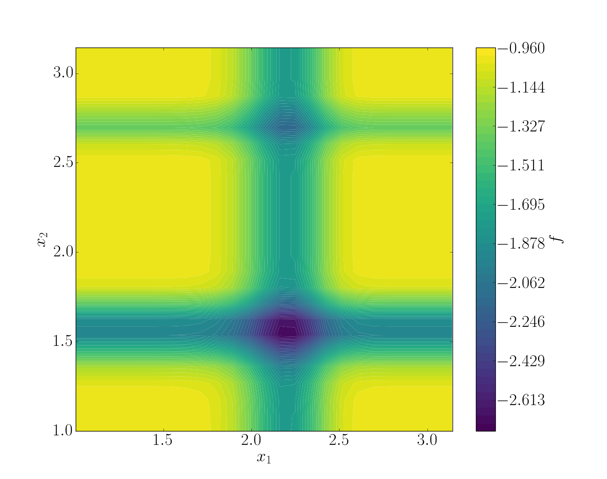
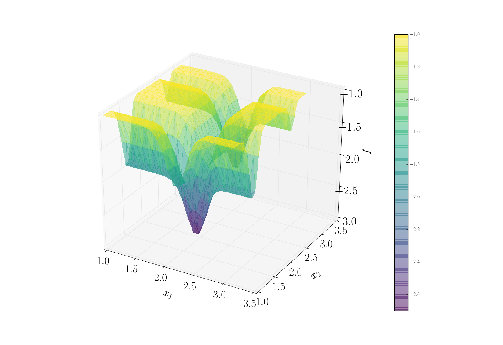
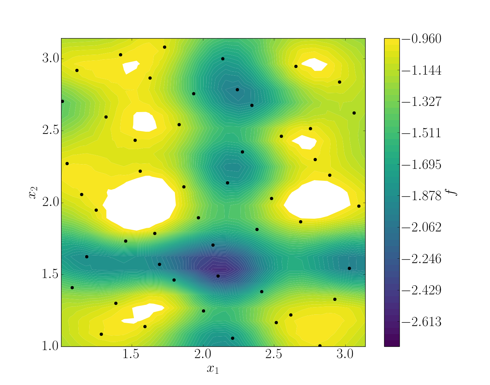
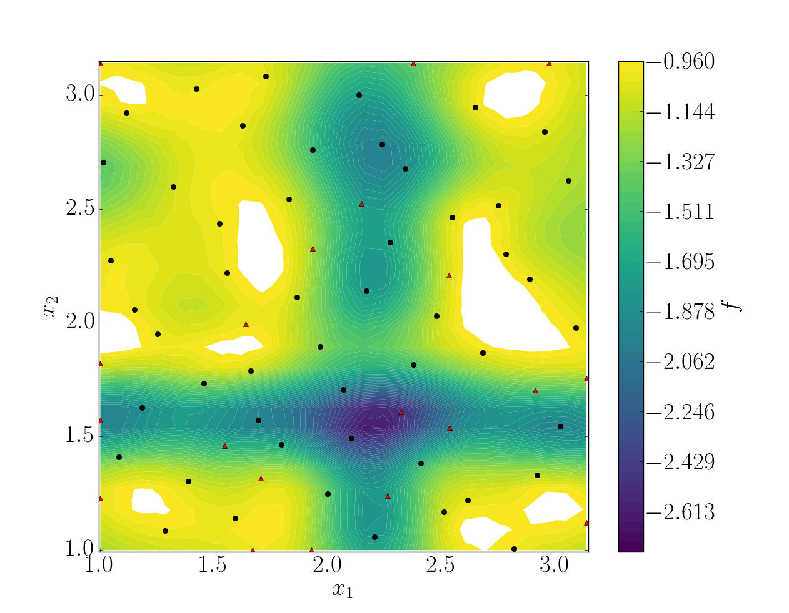
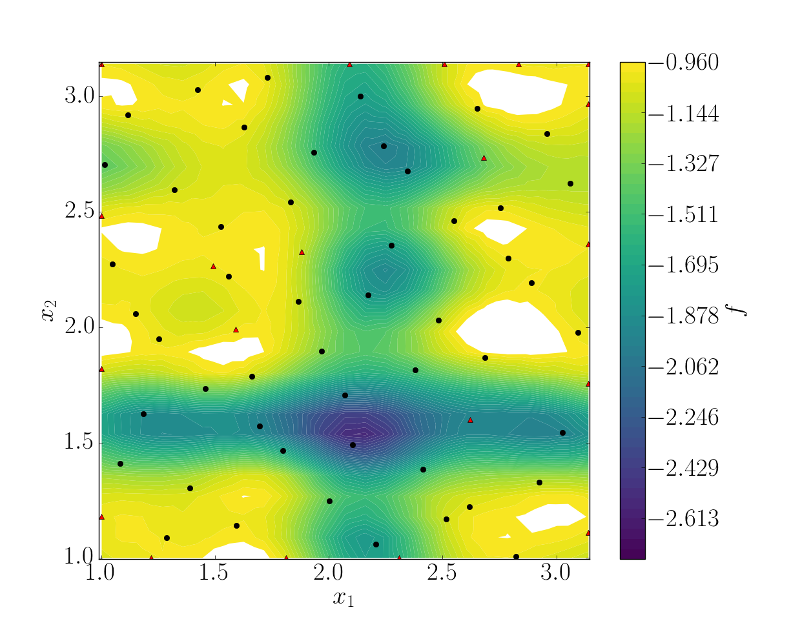

.. _michalewicz:

Michalewicz function
====================

Introduction
------------

Examples can be found in BATMAN's installer subrepository ``test-cases``. To create a new study, use the same structure as this example on the *Michalewicz* function:

.. code::

    Michalewicz
    |
    |__ data
    |   |__ script.sh
    |   |__ function.py
    |
    |__ settings.json

The working directory consists in two parts: 

+ ``data``: contains all the simulation files necessary to perform a new simulation. It can be a simple python script to a complex code. The content of this directory will be copied for each snapshot. In all cases, ``script.sh`` launches the simulation.

+ ``settings.json``: contains the case setup.

.. note:: The following section is a step-by-step tutorial that can be applied to any case.

Michalewicz Function
-------------------- 

Step 1: Simulation directory
............................

For this tutorial, the `Michalewicz function <http://www.sfu.ca/~ssurjano/michal.html>`_ was choosen. It is a multimodal *d*-dimensional function which has :math:`d!` local minima - for this *test-case*: 

.. math:: f(x)=-\sum_{i=1}^d \sin(x_i)\sin^{2m}\left(\frac{ix_i^2}{\pi}\right),

where *m* defines the steepness of the valleys and ridges.

.. note:: + It is to difficult to search a global minimum when :math:`m` reaches large value. Therefore, it is recommended to have :math:`m < 10`.
          + In this case we used the two-dimensional form, i.e. :math:`d = 2`. 

To summarize, we have the Michalewicz 2*D* function as follows:

.. math:: f(x)=-\sin(x_1)\sin^{20}\left(\frac{x_1^2}{\pi}\right)-\sin(x_2)\sin^{20}\left(\frac{2x_2^2}{\pi}\right).

.. seealso:: For other *optimization functions*, read more at `this website <http://www.sfu.ca/~ssurjano/optimization.html>`_.

* Create the case for BATMAN

For each snapshot, BATMAN will copy the content of ``data`` and add a new folder ``batman-coupling`` which contains a single file ``point.json``. The content of this file is updated per snapshot and it only contains the input parameters to change for the current simulation. Hence, to use Michalewicz's function with BATMAN, we need to have this file read to gather input parameters.

Aside from the simulation code and this headers, there is a ``script.sh``. It is this script that is launched by BATMAN. Once it is completed, the computation is considered as finished. Thus, this script manages a solver launch, calls a python script, etc.

In the end, the quantity of interest has to be written in tecplot format within the directory ``batman-coupling``.

.. note:: These directories' name and path are fully configurables.

.. note:: For a simple function script, you can pass it directly in the settings file.

Step 2: Setting up the case
...........................

BATMAN's settings are managed via a python file located in ``scripts``. An example template can be found within all examples directory. This file consists in five blocks with different functions:

* Block 1 - Space of Parameters

The space of parameters is created using the two extrem points of the domain here we have :math:`x_1, x_2 \in [1, \pi]^2`. Also we want to make 50 snapshots using a halton sequence.

.. code-block:: python

    "space": {
        "corners": [
            [1.0, 1.0],
            [3.1415, 3.1415]
        ],
        "sampling": {
            "init_size": 50,
            "method": "halton"
        },
    }

* Block 2 - Snapshot provider

Then, we configure the snapshot itself. We define the name of the header and output file as well as the dimension of the output. Here BATMAN will look at the variable ``F``, which is a scalar value, within the file ``point.json``.

.. code-block:: python

    "snapshot": {
        "max_workers": 10,
        "plabels": ["x1", "x2"],
        "flabels": ["F"],
        "provider": {
            "type": "job"
            "command": "bash script.sh",
            "context_directory": "data",
            "coupling": {"coupling_directory": "batman-coupling"},
            "clean": false
        },
        "io": {
            "space_fname": "point.json",
            "data_fname": "point.json"
        }
    }

.. note:: For a simple python function, you can pass it directly in the settings file::

        "provider": {
            "type": "function",
            "module": "python_module",
            "function": "func_name"
        }

    with ``module`` the name of the python module containing the function ``function``. For an example, see ``test_cases/Ishigami``.

* Block 3 - POD

In this example, a POD is not necessary as it will result in only one mode. However, its use is presented. We can control the quality of the POD, chose a re-sampling strategy, etc.

.. code-block:: python

    "pod": {
        "dim_max": 100,
        "quality": 0.8,
        "tolerance": 0.99,
        "type": "static"
    }

* Block 4 - Surrogate

A model is build on the snapshot matrix to approximate a new snapshot. The Kriging method is selected. To construct a response surface, we need to make predictions.

.. code-block:: python

    surrogate = {'method' : 'kriging',
                 'predictions' : [[1., 2.], [2., 2.]],
                 }

To fill in easily ``predictions``, use the script ``prediction.py``.

 Block 5 - UQ

Once the model has been created, it can be used to perform a statistical analysis. Here, Sobol' indices are computed using Sobol's method using 50000 samples. 

.. code-block:: python

    "uq": {
        "sample": 50000,
        "pdf": ["Uniform(1., 3.1415)", "Uniform(1., 3.1415)"],
        "type": "aggregated",
        "method": "sobol"
    }

Step 3: Running BATMAN
......................

To launch BATMAN, simply call it with::

    batman settings.json -qsu

BATMAN's log are found within ``BATMAN.log``. Here is an extract:: 

    BATMAN main ::
        POD summary:
        modes filtering tolerance    : 0.99
        dimension of parameter space : 2
        number of snapshots          : 50
        number of data per snapshot  : 1
        maximum number of modes      : 100
        number of modes              : 1
        modes                        : [ 2.69091785]
    batman.pod.pod ::
        pod quality = 0.45977, max error location = (3.0263943749999997, 1.5448927777777777)

    ----- Sobol' indices -----
    batman.uq ::
        Second order: [array([[ 0.        ,  0.06490131],
           [ 0.06490131,  0.        ]])]
    batman.uq ::
        First order: [array([ 0.43424729,  0.49512012])]
    batman.uq ::
        Total: [array([ 0.51371718,  0.56966205])]

In this example, the quality of the model is estimated around :math:`Q_2\sim 0.46` which means that the model is able to represents around 46% of the variability of the quantity of interest. Also, from *Sobol'* indices, both parameters appears to be as important.

Post-treatment
..............

Result files are separated in 4 directories under ``output``::

     Case
     |
     |__ data
     |
     |__ settings.json
     |
     |__ output
         |
         |__ predictions
         |
         |__ snapshots
         |
         |__ space
         |
         |__ surrogate
         |
         |__ uq
         |
         |__ visualization

* ``predictions:`` all predictions,
* ``snapshots:`` snapshots computations,
* ``space:`` contains the design of experiments,
* ``surrogate:`` the surrogate model info,
* ``uq:`` the statistical analysis,
* ``visualization:`` some plots.

Using predictions we can plot the response surface of the function as calculated using the model:

It can be noted that using 50 snapshots on this case is not enought to capture all the non-linearities of the function.

.. note:: Usually, physical phenomena are smoother. Thus, less points are needed for a 2 parameters problem when dealing with real physics.

Refinement strategies
.....................

In this case, the error was fairly high using 50 snapshots. A computation with 50 snapshots using 20 refinement points have been tried. To use this functionnality, the resampling dictionary has to be added:

.. code-block:: python

    "resampling":{
            "delta_space": 0.08,
            "resamp_size": 20,
            "method": "loo_sigma",
            "q2_criteria": 0.8
        }

This block tells BATMAN to compute a maximum of 20 resampling snapshots in case the quality has not reach 0.8. This ``loo_sigma`` strategy uses the information of the model error provided by the gaussian process regression. This leads to an improvement in the error with :math:`Q_2 \sim 0.71`.

   
   Response surface interpolation using 50 snapshots and 20 refined points,
   represented by the red triangles.

Using a basic ``sigma`` technique with again 20 new snapshots, the error is :math:`Q_2 \sim 0.60`.

In this case, ``loo_sigma`` method performed better but this is highly case dependent. 
