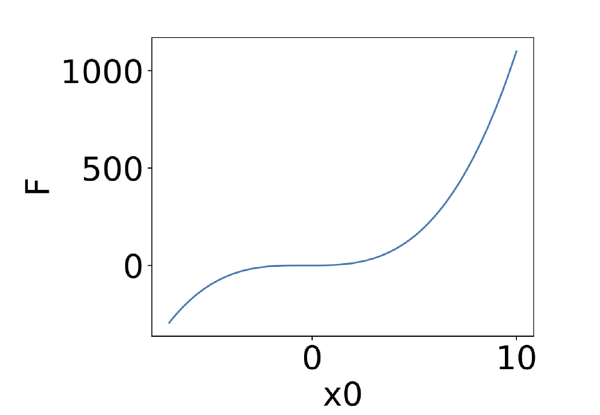
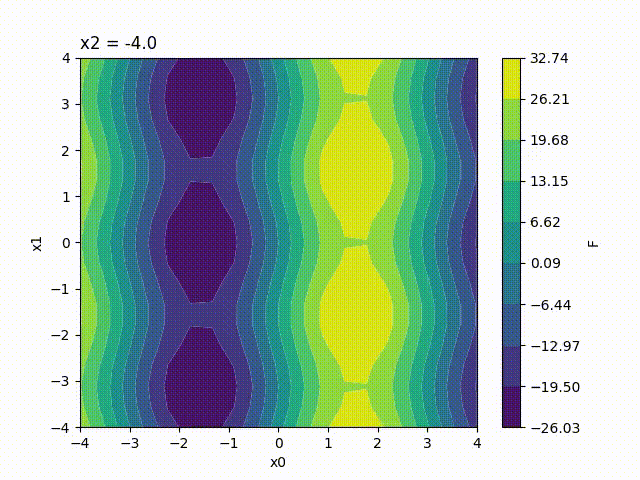
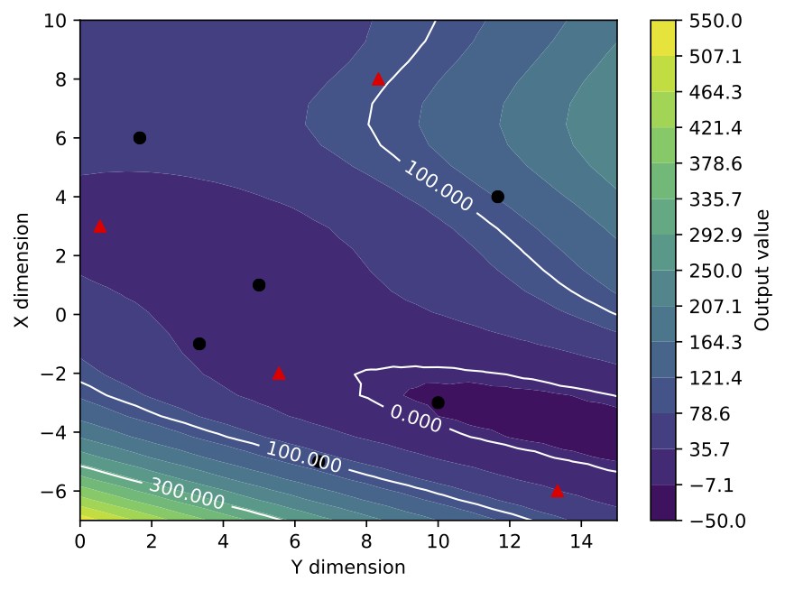

.. _user:

User Guide
==========

Introduction
------------

The use of computational simulations in many areas of science has proven to be reliable, faster and cheaper than experimental campaigns. However, the parametric analysis needs a large amount of simulations which is not feasible when using huge codes that are time and resources consuming. An efficient solution to overcome this issue is to construct models that are able to estimate correctly the responds of the codes. These models, called *Surroagte Models*, require a realistic amount of evaluation of the codes and the general procedure to construct them consists in:

* Generating a sample space:
    Produce a set of data from which to run the code. The points contained in this set all called  *snapshot*.

* Learning the link between the input the output data:
    From the previously generated set of data, we can compute a model, which  is build using gaussian process [Rasmussen2006]_ or polynomial chaos expansion [Najm2009]_.

* Predictng solutions from a new set of input data:
    The model can finaly be used to interpolate a new snapshot from a new set of input data.

.. image:: ./fig/surrogate.pdf

.. warning:: The model cannot be used for extrapolation. Indeed, it has been constructed using a sampling of the space of parameters. If we want to predict a point which is not contained within this space, the error is not contained as the point is not balanced by points surrounding it. As a famous catastrophe, an extrapolation of the physical properties of an o-ring of the *Challenger* space shuttle lead to an explosion during lift-off [Draper1995]_.

Both *Proper Orthogonal Decomposition* (POD) and *Kriging* (*PC*, *RBF*, etc.) are techniques that can interpolate data using snapshots. The main difference being that POD compresses the data it uses to use only the relevant modes whereas Kriging method doesn't reduce the size of the used snapshots. On the other hand, POD cannot reconstruct data from a domain missing ones [Gunes2006]_. Thus, the strategy used by BATMAN consists in:

0. Create a Design of Experiments,
1. Optionaly use POD reconstruction in order to compress data,
2. Construct a surrogate model [on POD's coefficients],
3. Interpolate new data.

Content of the package
----------------------

The BATMAN package includes: 

* ``doc`` contains the documentation,
* ``batman`` contains the module implementation,
* ``test_cases`` contains some example.

General functionment
....................

The package is composed of several python modules which are self contained within the directory ``batman``.
Following is a quick reference:

* :py:mod:`ui`: command line interface,
* :mod:`space`: defines the (re)sampling space,
* :py:mod:`surrogate`: constructs the surrogate model,
* :py:mod:`uq`: uncertainty quantification,
* :mod:`visualization`: uncertainty visualization,
* :py:mod:`pod`: constructs the POD,
* :py:mod:`driver`: contains the main functions,
* :py:mod:`tasks`: defines the context to compute each snapshot from,
* :py:mod:`functions`: defines usefull test functions,
* :py:mod:`misc`: defines the logging configuration and the settings schema.

Using it
........

After BATMAN has been installed, ``batman`` is available as a command line tool or it can be imported in python. The CLI is defined in :py:mod:`ui`. The module imports the package and use the function defined in :py:mod:`driver`.

Thus BATMAN is launched using::

    batman settings.json

An ``output`` directory is created and it contains the results of the computation splited across the following folders: 

* ``snapshots``,
* ``surrogate``,
* [``predictions``],
* [``uq``].

Content of ``test_cases``
.........................

This folder contains ready to launch examples: 

* ``Basic_function`` is a simple *1-input_parameter* function,
* ``Michalewicz`` is a *2-input_parameters* non-linear function,
* ``Ishigami`` is a *3-input_parameters*,
* ``G_Function`` is a *4-input_parameters*,
* ``Channel_Flow`` is a *2-input_parameters* with a functionnal output,
* ``RAE2822`` is a *2-input_parameters* that launches an *elsA* case,
* ``Flamme_1D`` is a *2-input_parameters* that launches an *AVBP* case.

In every case folder, there is ``README.rst`` file that summarizes and explains it.

Command Line Interface
----------------------

Introduction
............

The file ``settings.py`` contains the configuration of BATMAN. It can be devided into 2 mandatory blocks and 3 optionnal block. Fields in brackets are optionnal and there is no specific order to respect.

.. note:: A prefilled example is shown in ``settings.json`` located in ``test_cases/Snippets``.

Help of the CLI can be triggered with::
    
    batman -h

    usage: BATMAN [-h] [--version] [-v] [-c] [-s] [-o OUTPUT] [-r] [-n] [-u] [-q]
              settings

    BATMAN creates a surrogate model and perform UQ.

    positional arguments:
      settings              path to settings file

    optional arguments:
      -h, --help            show this help message and exit
      --version             show program's version number and exit
      -v, --verbose         set verbosity from WARNING to DEBUG, [default: False]
      -c, --check           check settings, [default: False]
      -s, --save-snapshots  save the snapshots to disk when using a function,
                            [default: False]
      -o OUTPUT, --output OUTPUT
                            path to output directory, [default: ./output]
      -r, --restart         restart pod, [default: False]
      -n, --no-surrogate    do not compute surrogate but read it from disk,
                            [default: False]
      -u, --uq              Uncertainty Quantification study, [default: False].
      -q, --q2              estimate Q2 and find the point with max MSE, [default:
                            False]    

.. note:: Fields in square brackets are optionnals.

Block 1 - Space of Parameters
.............................

First of all, we define the parameter space using an hypercube. Taking the minimal and the maximal value along all coordinates allow to describe it.

.. figure:: fig/hypercube.pdf

   3-dimentionnal hypercube

.. code-block:: python

    "space": {
        "corners": [
            [15.0, 2500.0],
            [60.0, 6000.0]
        ],
        "sampling": {
            "init_size": 4,
            "method": "halton"
        },
        "resampling":{
            "delta_space": 0.08,
            "resamp_size": 0,
            "method": "sigma",
            "hybrid": [["sigma", 4], ["loo_sobol", 2]],
            "q2_criteria": 0.9
        }
    }

+ ``corners``: define the space using the two corners of the hypercube ``[[min], [max]]``,
+ ``sampling``: define the configuration of the sample. This can either be; a list of sample
  as an array_like of shape (n_samples, n_features); or a dictionary with
  the following:

    * ``init_size``: define the initial number of snapshots,
    * ``method``: method to create the DoE, can be *uniform*, *faure*, *halton*,
      *sobol*, *sobolscramble*, *lhs* (Latin Hypercube Sampling), *lhsc* (Latin Hypercube  Sampling Centered) or *lhsopt* (optimized LHS), *saltelli*,
    * [``distributions``]: A list of distributions. Ex for two input variables:
      ``["Uniform(15., 60.)", "Normal(4035., 400.)"]``.

+ [``resampling``]: to do resampling, fill this dictionary

    * ``delta_space``: the percentage of space to shrink to not resample close to boundaries. For ``0.08``,
      the available space for resampling will be shrinked by 8%.
    * ``resamp_size``: number of point to add in the parameter space.
    * ``method``: to be choosen from ``sigma``, ``loo_sigma``, ``loo_sobol``, ``hybrid``, ``discrepancy``, ``optimization``, ``extrema``.
    * [``hybrid``]: if method is ``hybrid``. You have to define a generator which is a list
      ``[["method", n_snapshot]]``
    * ``q2_criteria``: stopping criterion based on the quality estimation of the model.

The method used to create the DoE is paramount. It ensures that that the physics
will be captured correclty all over the domain of interest.
All *faure*, *halton* and *sobol* methods are low discrepancy sequences with
good filling properties. *saltelli* is particular as it will create a DoE for
the computation of *Sobol'* indices using *Saltelli*'s formulation.

When *distribution* is set, a join distribution is built an is used to perform
an inverse transformation (inverse CDF) on the sample. This allows to have a
low discrepancy sample will still following some distribution.

Regarding the resampling, all methods need a good initial sample. Meanning that the quality is about :math:`Q_2\sim0.5`. ``loo_sigma, loo_sobol`` work better than ``sigma`` in high dimentionnal cases (>2).

.. warning:: If using a PC surrogate model, the only possibilities are ``discrepancy`` and ``extrema``. Furthermore, sampling ``method`` must be set as a list of distributions.

Block 2 - Snapshot provider
...........................

A snapshot defines a simulation.

.. code-block:: python

    "snapshot": {
        "max_workers": 5,
        "io": {
            "shapes": {
                "0": [
                    [400]
                ]
            },
            "format": "fmt_tp_fortran",
            "variables": ["X", "F"],
            "point_filename": "point.json",
            "filenames": {
                "0": ["function.dat"]
            },
            "template_directory": "output/snapshots/0/batman-data/point.json",
            "parameter_names": ["x1", "x2"]
        },
        "provider": {
            "command": "bash",
            "timeout": 20,
            "context": "data",
            "script": "data/script.sh",
            "clean": false,
            "private-directory": "batman-data",
            "data-directory": "cfd-output-data",
            "restart": "False"
        }

+ ``max_workers``: maximum number of simultaneous running snapshot,
+ ``shapes``: shape per variable and per file,
+ ``format``:  ``npz``, ``fmt_tp_fortran`` (BATMAN) or all Antares formats if installed,
+ ``variables``: names of the variables to treat and contained in a snapshot,
+ ``point_filename``: name of the file that contains the coordinates of a point in the parameter space,
+ ``filenames``: dictionary of list, if several filenames, several independant analysis are done. It contains the output ``variables`` of a snapshot to use by BATMAN,
+ ``template_directory``: path to the point file name of the first snapshot, used to restart from existing jobs not created with BATMAN,
+ ``parameter_names``: names of the parameters.

The ``provider`` defines what is a simulation. If we simply want to evaluate a python function, we can pass the ``function_name`` as a string. ``function_name.py`` will be imported and the function named ``f`` will be used. Otherwize, for a complexe case, use a dictionary:

+ ``command``: command to use to launch the script,
+ ``timeout``: timeout of each jobs in seconds,
+ ``context``: directiory where the data for the BATMAN computations are stored,
+ ``script``: path of the script or batch to run,
+ ``clean``: delete after run all except what is inside ``private-directory``
+ ``private-directory``: folder containing the ``point_filename`` and the result of the snapshot
+ ``data-directory``: output folder to store the ``filenames``,
+ ``restart``: restart the computation if the job has failed.

Optionnal Block 3 - Surrogate
.............................

Set up the surrogate model strategy to use.

.. code-block:: python

    "prediction": {
        "method": "kriging",
        "predictions": [[30, 4000], [35, 3550]]
    }

+ ``method``: method used to generate a snapshot one of *rbf* (Radial Basic Function), *kriging*, *pc* (polynomial chaos expension) or *evofusion* method.
+ [``predictions``]: set of points to predict.

For *kriging* the following extra attributes **can** be set: 

+ [``kernel``]: kernel to use. Ex: ``"ConstantKernel() + Matern(length_scale=1., nu=1.5)"``.
+ [``noise``]: noise level as boolean or as a float.

For *pc* the following extra attributes **must** be set: 

+ ``strategy``: either using quadrature or least square one of *Quad* or *LS*.
+ ``degree``: the polynomial degree.

.. note:: When using *pc*, the ``sampling`` must be set to a list of distributions.

For *evofusion* the following extra attributes **must** be set: 

+ ``cost_ratio``: cost ratio in terms of function evaluation between high and low fidelity models.
+ ``grand_cost``: total cost of the study in terms of number of function evaluation of the high fidelity model.

.. note:: We can fill *directly* the number of points into the brackets or *indirectly* using the script ``prediction.py`` located in ``test_cases/Snippets``.

Optionnal Block 4 - UQ
......................

Uncertainty Quantification (UQ)

.. code-block:: python

    "uq": {
        "test": "Channel_Flow"
        "sample": 1000,
        "method": "sobol"
        "pdf": ["Normal(4035., 400)", "Uniform(15, 60)"],
        "type": "aggregated",
    }

+ ``test``: use a test method for indices comparison and quality calculation. Use one of: *Rosenbrock*, *Michalewicz*, *Ishigami*, *G_Function*, *Channel_Flow*,
+ ``sample``: number of points per sample to use for SA,
+ ``method``: type of Sobol analysis: *sobol*, *FAST* (Fourier Amplitude Sensitivity Testing). If FAST, no second-order indices are computed and defining a surrogate model is mandatory.
+ ``type``: type of indices: *aggregated* or *block*.

+ ``pdf`` *Probability density function* for uncertainty propagation. Enter the PDF of the inputs,
  as list of openturns distributions. Ex: x1-Normal(mu, sigma), x2-Uniform(inf, sup)
  => ``["Uniform(15., 60.)", "Normal(4035., 400.)"]``

Optionnal Block 5 - POD
.......................

POD (or Proper Orthogonal Decomposition) is a approach to help reduce amount of data.

.. code-block:: python

     "pod": {
        "dim_max": 100,
        "tolerance": 0.99,
        "type": "static"
     }

+ ``tolerance``: tolerance of the modes to be kept. A percentage of the sum of the singular values, values that account for less than this tolerance are ignored,
+ ``dim_max``: maximum number of modes to be kept,
+ ``type``: type of POD to perform: *static* or *dynamic*.

The dynamic POD allows to update the POD once a snapshot is availlable. Hence a POD can be restarted when doing resampling for example.

Optionnal Block 6 - Visualization
.................................

Set up for the visualization options. Batman creates a response function (1 input parameter), response surfaces (2 to 4 input parameters) or a Kiviat graph (more than 4 input parameters).

.. code-block:: python

     "visualization": {
        "doe": true,
        "resampling": true,
        "axis_disc": [20, 20],
        "flabel": "Cost function",
        "plabels": ["X", "Y"],
        "feat_order": [1, 2],
        "ticks_nbr": 14,
        "range_cbar": [0.0, 2.3],
        "contours": [0.5, 1.0, 1.5],
     }

+ ``doe``: Boolean. If *true*, the Design of Experiment is represented on the response surface by black dots. Defaults value is *false*,
+ ``resampling``: Boolean. If *true*, Design of Experiment corresponding to the resampling points are displayed in a different color. Such points are represented by red triangles. Only activates if doe is *true*,
+ ``axis_disc``: Integers. Discretisation of each axis. Indicated value for the x and the y axis modify the surface resolution, while values corresponding the the 3rd and 4th parameters impact the frame number per movie and the movie number,
+ ``flabel``: String. Name of the cost function,
+ ``plabels``: Strings. Name of the input parameters to be plotted on each axis,
+ ``feat_order``: Integers. Associate each input parameter to an axis, the first indicated number corresponding to the parameter to be plotted on the x-axis, etc... A size equal to the input parameter number is expected, all integers from 1 to the parameter number should be used. Default is *[1, 2, 3, 4]*,
+ ``ticks_nbr``: Integer. Number of ticks on the colorbar (Display n-1 colors). Default is *10*,
+ ``range_cbar``: Floats. Minimum and maximum values on the colorbar,
+ ``contours``: Floats. Values of the iso-contours to be plotted on the response surface,

.. py:module:: driver
.. py:currentmodule:: driver

Driver module
.............

.. automodule:: batman.driver
   :members:
   :undoc-members:

Surrogate model
---------------

Generalities
............

A common class is used to manage surrogate models. Hence, several kind of surrogate model strategies can be used::

    predictor = batman.surrogate.SurrogateModel('kriging', corners)
    predictor.fit(space, target_space)
    predictor.save('.')
    points = [(12.5, 56.8), (2.2, 5.3)]
    predictions = predictor(points)

From *Kriging* to *Gaussian Process*
....................................

* Kriging, a geostatistical method  

*Kriging* is a geostatistical interpolation method that use not only the distance between the neighbouring points but also the relationships among these points, the autocorrelation. The method has been created by D.G. Krige [Krige1989]_ and has been formalized by G. Matheron [Matheron1963]_.

In order to predict an unmeasured location :math:`\hat{Y}`, interpolation methods use the surrounding measured values :math:`Y_i` and weight them:

.. math::
    \hat{Y} = \sum_{i = 1}^{N} \lambda_i Y_i.

The advantage of this method is that the interpolation is exact at the sampled points and that it gives an estimation of the prediction error. Ordinary *Kriging* consists in the *Best Linear Unbiased Predictor* (BLUP) [Robinson1991]_:

Best
    It minimizes the variance of the predicted error :math:`Var(\hat{Y} - Y)`,

Linear
    A linear combination of the data,

Unbiased
    It minimizes the mean square error :math:`E[\hat{Y} - Y]^2` thus :math:`\sum_{i=1}^{N} \lambda_i(x)=1`, 

Predictor
    It is an estimator of random effects.

:math:`\lambda_i` are calculated using the spatial autocorrelation of the data, it is a variography analysis. Plots can be constructed using semivariance, covariance or correlation. An empirical variogram plot allows to see the values that should be alike because they are close to each other \cite{Bohling2005}. The empirical semivariogram is given by:

.. math::
    \gamma(h) = \frac{1}{2}\times \frac{1}{n} \sum_{i=1}^{N} (Y_i - Y_{i+h})^2.

A fitting model is then applied to this semivariogram. Hence, the variability of the model is inferior to data's. Kriging smooths the gradients. The exponential model is written as:

.. math::
    \gamma(h) = C(0) + C\left(1- \exp{\left(-\frac{h}{r}\right)}\right),

with :math:`C` the correlation matrice and the parameter :math:`r` is optimized using the sample points.

.. image:: fig/semivariogramme.pdf

A model is described using:

Sill
    It corresponds to the maximum of :math:`\gamma`. It defines the end of the range.

Range
    It is the zone of correlation. If the distance is superior to the range, there is no correlation, whereas if the distance is inferior to it, the sample locations are autocorrelated.

Nugget
    If the distance between the points is null, :math:`\gamma` should be null. However, measurement errors are inherent and cause a nugget effect. It is the y-intercept of the model.

Once the model is computed, the weights are determined to use the *MSE* condition and gives:

.. math:: \lambda_i = K^{-1}k,
 
:math:`K` being the covariance matrix :math:`K_{i,j} = C(Y_i-Y_j)` and :math:`k` being the covariance vector :math:`k_i = C(Y_i-Y)` with the covariance :math:`C(h) = C(0) - \gamma(h) = Sill-\gamma(h)`.
 
.. math::
    \begin{pmatrix}\gamma_{11}& \cdots & \gamma_{1j} \\ \vdots & \ddots & \vdots \\ \gamma_{i1} & \cdots  & \gamma_{nn}  \end{pmatrix} \begin{pmatrix}\lambda_1 \\ \vdots \\ \lambda_n \end{pmatrix} = \begin{pmatrix} \gamma_{1X} \\ \vdots \\ \gamma_{nX}\end{pmatrix}.

Furthermore we can express the field :math:`Y` as :math:`\hat{Y} = R(S) + m(S)` which is the residual and the trend components [Bohling2005]_. Depending on the treatment of the trend, there are several Kriging techniques (ordinary Kriging being the most used):

Simple
    The variable is stationary, the mean is known,

Ordinary
    The variable is stationary, the mean is unknown,

Universal
    The variable is non-stationary, there is a tendency.

Ordinary Kriging is the most used method. In this case, the covariance matrix is augmented:

.. math::
    \begin{pmatrix}\gamma_{11}& \cdots  & \gamma_{1j} & 1\\ \vdots & \ddots & \vdots & \vdots \\ \gamma_{i1} & \cdots  & \gamma_{nn} & 1 \\ 1 & \cdots & 1 & 0 \end{pmatrix} \begin{pmatrix}\lambda_1 \\ \vdots \\ \lambda_n \\ - \mu \end{pmatrix} = \begin{pmatrix} \gamma_{1X} \\ \vdots \\ \gamma_{nX} \\ 1\end{pmatrix}.

Once the weights are computed, its dot product with the residual :math:`R_i=Y_i-m` at the known points gives the residual :math:`R(S)`. Thus we have an estimation of :math:`\hat{Y}`. Finally, the error is estimated by the second order moment:

.. math:: \sigma^2 =  \sum_{i = 1}^{N} \lambda_i \gamma_{iX} - \mu.

Some care has to be taken with this estimation of the variance. Being a good indicator of the correctness of the estimation, this is only an estimation of the error based upon all surrounding points.

* Gaussian Process  

There are two approaches when dealing with regression problems. In simple cases, we can use simple functions in order to approximate the output set of data. On the other hand, when dealing with complex multidimensional problems with strong non-linearity, there are infinite possibilities of functions to consider. This is where the Gaussian process comes in.

As stated by Rasmussen et al. in [Rasmussen2006]_, a process is a generalization of a probability distribution of functions. When dealing with *Gaussian processes*, they can simply be fully defined using the mean and covariance of the functions: 

.. math::
    f(x)&\sim GP(m(x), k(x,x')),\\
    m(x) &= \mathbb{E}\left[ f(x)  \right], \\
    k(x,x') &= \mathbb{E}\left[ (f(x) -m(x))(f(x')-m(x')) \right].

.. figure:: fig/rasmussenGP.png

    Subfigure (a) shows four samples from a prior distribution. (b) shows the situation after two observations have been made. [Rasmussen2006]_.

Starting from a prior distribution of functions, it represents the belief we have on the problem. Without any assumption, the mean would be null. If we are now given a dataset :math:`D = \{(x_1, y_1), (x_2, y_2)\}`, we only consider the function that actually pass through or close to these points, as in the previous figure. This is the learning phase. The more points are added, the more the model will fit the function. Indeed, as we add observations, the error is reduced at these points.

The nature of the covariance matrix is of great importance as it fixes the properties of the functions to consider for inference. This matrix is also called *kernel*. Many covariance functions exist and they can be combined to fit specific needs. A common choice is the squared exponential covariance kernel:

.. math:: k(x, x') = \sqrt{\pi}l \sigma_p^2 \exp{- \frac{(x - x')^2}{2(\sqrt{2}l)^2}},

with :math:`l` the length scale, an hyperparameter, which depends on the magnitudes of the parameters. When dealing with a multidimensional case and non-homogeneous parameters, it is of prime importance to adimentionize everything as one input could bias the optimization of the hyperparameters. 

Then the Gaussian process regression is written as a linear regression

.. math::
    \hat{f}(x_*)&= \sum_{i = 1}^{n}\alpha_i k (x_i, x_*),\\
    \alpha &= (K + \sigma_n^2 I)^{-1}y.

One of the main benefit of this method, is that it provides an information about the variance

.. math::
    \mathbb{V}[f(\mathbf{x}_*)] = k(\mathbf{x}_*, \mathbf{x}_*)-\mathbf{k}(\mathbf{x}_*)^T(K + \sigma_n^2 I)^{-1}\mathbf{k}(\mathbf{x}_*).

The Kriging method is one of the most employed as of today. We can even enhance the result of the regression if we have access to the derivative (or even the hessian) of the function [Forrester2009]_. This could be even more challenging if we don't have an adjoint solver to compute it. Another method is to use a multi-fidelity metamodel in order to obtain an even better solution. This can be performed if we have two codes that compute the same thing or if we have two grids to run from.

Proper Orthogonal Decomposition
...............................

* What is it ?

The *Proper Orthogonal Decomposition* (POD) is a technique used to decompose a matrix and characterize it by its principal components which are called modes [AnindyaChatterjee2000]_. To approximate a function :math:`z(x,t)`, only a finite sum of terms is required:

.. math::
      z(x,t) \simeq \sum_{k=1}^{m} a_k(t) \phi_k(x).

The function :math:`\phi_{k}(x)` have an infinite representation. It can be chosen as a Fourier series or Chebyshev polynomials, etc. For a chosen basis of function, a set of unique time-functions :math:`a_k(t)` arise. In case of the POD, the basis function are orthonormal. Meaning that:

.. math::
      \int_{x} \phi_{k_1} \phi_{k_2} dx &= \left\{\begin{array}{rcl} 1 & \text{if} & k_1 = k_2   \\ 0 & \text{if} & k_1 \neq k_2\end{array}\right. ,\\
   a_k (t) &= \int_{x} z(x,t) \phi_k(x) dx.

The principle of the POD is to choose :math:`\phi_k(x)` such that the approximation of :math:`z(x,t)` is the best in a least squares sense. These orthonormal functions are called the *proper orthogonal modes* of the function.

When dealing with CFD simulations, the size of the domain :math:`m` is usually smaller than the number of measures, snapshots, :math:`n`. Hence, from the existing decomposition methods, the *Singular Value Decomposition* (SVD) is used. It is the snapshots methods [Cordier2006]_.

The Singular Value Decomposition (SVD) is a factorization operation of a matrix expressed as:

.. math::
      A = U \Sigma V^T,

with :math:`V` diagonalizes :math:`A^TA`, :math:`U` diagonalizes :math:`AA^T` and :math:`\Sigma` is the singular value matrix which diagonal is composed by the singular values of :math:`A`. Knowing that a singular value is the square root of an eigen value. :math:`u_i` and :math:`v_i` are eigen vectors of respectively :math:`U` and :math:`V` which form an orthonormal basis. Thus, the initial matrix can be rewritten:

.. math::
      A = \sum_{i=1}^{r} \sigma_i u_i v_i^T,

:math:`r` being the rank of the matrix. If taken :math:`k < r`, an approximation of the initial matrix can be constructed. This allows to compress the data as only an extract of :math:`u` and :math:`v` need to be stored.

References :

.. [AnindyaChatterjee2000] Anindya Chatterjee. “An introduction to the proper orthogonal decomposition”. Current Science 78.7. 2000.
.. [Cordier2006] L. Cordierand M. Bergmann. “Réduction de dynamique par décomposition orthogonale aux valeurs propres (POD)”. Ecole de printemps OCET. 2006.

Multifidelity
.............

It is possible to combine several level of fidelity in order to lower the computational cost of the surrogate
building process. The fidelity can be either expressed as a mesh difference, a convergence difference, or even a
different set of solvers. [Forrester2006]_ proposed a way of combining these fidelities by building a low
fidelity model and correct it using a model of the error:

.. math:: \hat{f}(x) = f_c(x) + \hat{f}_{\epsilon}(f_e(x), f_c(x)),

with :math:`\hat{f}_{\epsilon}` the surrogate model representing the error between the two fidelity levels.
This method needs nested design of experiments for the error model to be computed.

Considering two levels of fidelity :math:`f_e` and :math:`f_c`, respectively an expensive and a cheap function expressed as a computational cost. A cost ratio :math:`\alpha` between the two can be defined as:

.. math:: \alpha = \frac{f_e}{f_c}.

Using this cost relationship an setting a computational budget :math:`C`, it is possible to get a relation between the number of cheap and expensive realizations:

.. math:: C f_e &= N_e f_e + N_c f_c,\\
          C f_e &= N_e f_e + N_c\frac{\alpha}{f_e},\\
          C &= N_e + N_c\alpha, \\
          N_c &= \frac{C - N_e}{\alpha}.

As the design being nested, the number of cheap experiments must be strictly superior to the number or expensive ones. Indeed, the opposite would result in no additional information to the system.

References
..........

.. [Krige1989] D.G. Krige, et al. “Early South African geostatistical techniques in today’s perspective”. Geostatistics 1. 1989. 
.. [Matheron1963] G. Matheron. “Principles of Geostatistics”. Economic Geology 58. 1963. 
.. [Robinson1991] G.K.Robinson.“That BLUP is a good thing: the estimation of random effects”. Statistical Science 6.1. 1991. DOI: 10.1214/ss/1177011926. 
.. [Bohling2005] G. Bohling. "Kriging". Tech.rep. 2005. 
.. [Forrester2006] Forrester, Alexander I.J, et al. "Optimization using surrogate models and partially converged computational fluid dynamics simulations". Proceedings of the Royal Society A: Mathematical, Physical and Engineering Science. 2006. DOI: 10.1098/rspa.2006.1679 
.. [Forrester2009] Forrester and A.J. Keane.“Recent advances in surrogate-based optimization”. Progress in Aerospace Sciences 2009. DOI: 10.1016/j.paerosci.2008.11.001 

Sampling the Space of Parameters
--------------------------------

Design of Experiments
.....................

Whatever method is used, the first step consists in defining how we are going to modify input variables to retrieve the evolution of the response surface. This is called a Design of Experiments (DoE) as defined by [Sacks1989]_. The parameter space is called a ``Space``::

    space = batman.space.Space([[1, 1], [3, 3]])
    space.sampling(10, 'halton')
    space.write('.')

.. image:: ./fig/halton_25.pdf

The quality of the DoE is paramount as it determines the physics that will be observed. If the space is not filled properly, homogeneously, we can bias our analysis and retrieve only a particular behaviour of the physic. This concept has been extensively been used in experiments, especially the one-at-a-time design, which consists of only changing only one parameter at a time. Doing so, the space is not filled properly and only simple behaviours can be recovered. In order to assess the quality of the sampling, the discrepancy is usually used. It is an indicator of the distance between the points within the parameters space. The lower the discrepancy is, the better the design is. This information can be used to optimize a DoE Among all formulations of this criterion, the centered discrepancy is the most robust one [Damblin2013]_.
This information can be computed from the space::

    space.discrepancy()

As stated before, the golden standard would be to perform a *Monte Carlo* sampling but it would require a huge sampling which is unfeasible with costly numerical simulations. Therefore are found random (or quasi-random) sampling methods. Low discrepancy sequence has been designed to overcome this issue. These designs are built upon a pattern, a sequence, depending on factors such as prime numbers. This allows a fast generation of sampling space with good properties. A well-known method is the Latin Hypercube Sampling (LHS). The idea behind is to discretize the space to get a regular grid and sample randomly a point per zone.

In Damblin et al. [Damblin2013]_ a comprehensive analysis of most common DOE is found. In the end, the *Sobol'* or *Halton* DOE are sufficient when dealing with a small number of parameters (<5). With an increasing number of parameters, patterns start to appear and optimized LHS are required.

Resampling the parameters space
...............................

There are several methods for refining, resampling, the parameter space. In [Scheidt]_, the classical methods are reviewed and a framework combining several methods is proposed. In [Roy2017]_, we added some methods that peforme better in high dimentionnal cases.
In BATMAN, the following methods are available:

* Variance (:math:`\sigma`),
  One of the main advantages of Gaussian processes over other surrogates is to provide an insight into the variance of the solution. The first method consists in using this data and weight it with the eigenvalues of the POD:

  .. math:: \sum_{i=1}^k \sigma_i^2 \times \mathbb{V}[f(\mathbf{x}_*)]_{i}.

  Global optimization on this indicator gives the new point to simulate.

* Leave-One-Out (LOO) and :math:`\sigma`,
  A LOO is performed on the POD and highlights the point where the model is the most sensitive. The strategy here is to add a new point around it. Within this hypercube, a global optimization over :math:`\sigma` is conduced giving the new point.

* LOO-*Sobol'*,
  Using the same steps as with the LOO - :math:`\sigma` method, the hypercube around the point is here truncated using prior information about *Sobol* . It requires that indices be close to convergence not to bias the result. Or the bias can be intentional depending on the insight we have about the case.

* Extrema,
  This method will add 4 points. First, it look for the point in the sample which has the min value of the QoI. Within an hypercube, it add the minimal and maximal predicted values. Then it do the same for the point of the sample which has the max value of the QoI. This method allows to capture the gradient around extrem values.

* Hybrid,
  This last method consists of a navigator composed by any combination of the previous methods.

* Discrepancy.
  Simply add a point that minimize the discrepancy.

It is fairly easy to resample the parameter space. From a space and a surrogate::

    new_point = space.refine(surrogate)

* Hypercube  

The hypercube is defined by the cartesian product of the intervals of the :math:`n` parameters *i.e.* :math:`[a_i, b_i]^n`. The constrained optimization problem can hence be written as:

.. math::
   \left\{\begin{array}{rc} \max  &\parallel (\mathbf{b} - \mathbf{a}) \parallel_{2} \\\mathcal{P} &\notin [a_i, b_i]^n \\ p &\in [a_i, b_i]^n \end{array}\right. .

Moreover, a maximum cube-volume aspect ratio is defined in order to preserve the locality. This gives the new constrain

.. math::
   C : \sqrt[n]{\frac{\max (\mathbf{b} - \mathbf{a})}{\displaystyle\prod_{i = 1}^n \max (b_i - a_i)}} < \epsilon ,

with :math:`\epsilon = 1.5` is set arbitrarily to prevent too elongated hypercubes. The global optimum is found using a two-step strategy: first, a discrete optimization using :math:`\mathcal{P}` gives an initial solution; second a basin-hopping algorithm finds the optimum coordinates of the hypercube. In case of the LOO-*Sobol'* method, the hypercube is truncated using the total order *Sobol'* indices.

Efficient Global Optimization (EGO)
...................................

In the case of a surrogate model based on a gaussian process, Efficient Global Optimization (EGO) [Jones1998]_ algorithm can be used to resample the parameter space in directive to an optimization. It comprises as a tradeoff between the actual minimal value :math:`f_{min}` and an expected value given by the standard error :math:`s` for a given prediction :math:`\hat{y}`. The expected improvement is defined as:

.. math:: \mathbb{E}[I(x)] = (f_{min} - \hat{y})\Phi \left( \frac{f_{min} - \hat{y}}{s} \right) + s\phi \left( \frac{f_{min} - \hat{y}}{s} \right),

with :math:`\phi(.), \Phi(.)` the standard normal density and distribution function. Using the fact that this quantify is monotonic in :math:`\hat{y}` and :math:`s`, it reduces to the probability of improvement:

.. math:: \frac{\partial \mathbb{E}[I(x)]}{\partial \hat{y}} &= - \Phi \left( \frac{f_{min} - \hat{y}}{s} \right) < 0, \\
          \frac{\partial \mathbb{E}[I(x)]}{\partial s} &= \phi \left( \frac{f_{min} - \hat{y}}{s} \right) > 0.

References
..........

.. [Damblin2013] G. Damblin, M. Couplet, B. Iooss: Numerical studies of space filling designs : optimization of Latin Hypercube Samples and subprojection properties. Journal of Simulation. 2013 
.. [Sacks1989] J. Sacks et al.: Design and Analysis of Computer Experiments. Statistical Science 4.4. 1989. DOI: 10.1214/ss/1177012413 
.. [Scheidt] C. Scheidt: Analyse statistique d'expériences simulées : Modélisation adaptative de réponses non régulières par Krigeage et plans d'expériences, Application à la quantification des incertitudes en ingénierie des réservoirs pétroliers. Université Louis Pasteur. 2006 
.. [Roy2017] P.T. Roy et al.: Resampling Strategies to Improve Surrogate Model-based Uncertainty Quantification - Application to LES of LS89. IJNMF. 2017 
.. [Jones1998] D. Jones et al.: Efficient Global Optimization of Expensive Black-Box Functions. Journal of Global Optimization 1998. DOI: 10.1023/a:1008306431147 

Uncertainty Quantification
--------------------------

What is Uncertainty
...................

As it can be infered from the name, Uncertainty Quantification (UQ) aims at undestanding the impact
of the uncertainties of a system. Uncertainties can be decomposed in two parts:

* Aleatoric: intrinsic variability of a system,
* Epistemic: lack of knowledge, models errors.

The aleatoric part is the one we seek to measure. For example, looking at an airfoil, if we change
the angle of attack, some change are expected on the lift and drag. On the other hand, the epistemic part
represent our bias. Using RANS models, the turbulence is entirelly modeled---as opposed to LES where we compute most of it---so
we might miss some phenomena.

Then, there are three kind of uncrtainty study: 

* Uncertainty Propagation: observe the response of the system to perturbed inputs (PDF, response surface),
* Sensitivity Analysis: measure the respective importance of the input parameters,
* Risk Assessment: get the probability to exceed a threshold.

In any case, from perturbed input we are looking at the output response of a quantity of interest
.

*Sobol'* indices
................

There are several methods to estimate the contribution of different parameters on quantities of interest [iooss2015]_.
Among them, sensitivity methods based on the analysis of the variance allow to obtain the contribution of the parameters on the QoI's variance [ferretti2016]_.
Here, classical *Sobol'* [Sobol1993]_ method is used which gives not only a ranking but also quantifies the importance factor using the variance.
This method only makes the hypothesis of the independence of the input variables.
It uses a functional decomposition of the variance of the function to explore:

.. math::
    \mathbb{V}(\mathcal{M}_{gp}) &= \sum_{i}^{p} \mathbb{V}_i (\mathcal{M}_{gp}) + \sum_{i<j}^{p}\mathbb{V}_{ij} + ... + \mathbb{V}_{1,2,...,p},\\
    \mathbb{V}_i(\mathcal{M}_{gp}) &= \mathbb{\mathbb{V}}[\mathbb{E}(\mathcal{M}_{gp}|x_i)]\\
    \mathbb{V}_{ij} &= \mathbb{\mathbb{V}}[\mathbb{E}(\mathcal{M}_{gp}|x_i x_j)] - \mathbb{V}_i - \mathbb{V}_j,

with :math:`p` the number of input parameters constituting :math:`\mathbf{x}`. This way *Sobol'* indices are expressed as

.. math:: S_i = \frac{\mathbb{V}[\mathbb{E}(\mathcal{M}_{gp}|x_i)]}{\mathbb{V}[\mathcal{M}_{gp}]}\qquad S_{ij} = \frac{\mathbb{V}[\mathbb{E}(\mathcal{M}_{gp}|x_i x_j)] - \mathbb{V}_i - \mathbb{V}_j}{\mathbb{V}[\mathcal{M}_{gp}]}.

:math:`S_{i}` corresponds to the first order term which apprises the contribution of the *i-th* parameter,
while :math:`S_{ij}` corresponds to the second order term which informs about the correlations between the *i-th* and the *j-th* parameters.
These equations can be generalized to compute higher order terms.
However, the computational effort to converge them is most often not at hand [iooss2010]_ and their analysis,
interpretations, are not simple.

Total indices represents the global contribution of the parameters on the QoI and express as:

.. math:: S_{T_i} = S_i + \sum_j S_{ij} + \sum_{j,k} S_{ijk} + ... \simeq 1 - S_{i}.

For a functional output, *Sobol'* indices can be computed all along the output and retrieve a map or create composite indices.
As described by Marrel [marrel2015]_, aggregated indices can also be computed as the mean of the indices weighted by the variance at each point or temporal step

.. math:: S_i = \frac{\displaystyle\sum_{l = 1}^{p} \mathbb{V} [\mathbf{f}_l] S_i^{l}}{\displaystyle\sum_{l = 1}^{p} \mathbb{V} [\mathbf{f}_l]}.

The indices are estimated using *Martinez*' formulation. In [baudin2016]_,
they showed that this estimator is stable and provides asymptotic confidence intervals---approximated with Fisher's transformation---for first order and total order indices.

Uncertainty propagation
.......................

Instead of looking at the individual contributions of the input parameters,
the easyest way to assess uncertainties is to perform simulations by perturbing the input distributions
using particular distributions. The quantitie of interest can then be visualized.
This is called a response surface. A complementary analysis can be drawn from here as ones can compute the
Probability Density Function (PDF) of the output. In order for these statistical information to be relevant, a large number of simulations is required.

References
..........

.. [iooss2015] Iooss B. and Saltelli A.: Introduction to Sensitivity Analysis. Handbook of UQ. 2015. DOI: 10.1007/978-3-319-11259-6_31-1 
.. [ferretti2016] Ferretti F. and Saltelli A. et al.: Trends in sensitivity analysis practice in the last decade. Science of the Total Environment. 2016. DOI: 10.1016/j.scitotenv.2016.02.133 
.. [Sobol1993] Sobol' I.M. Sensitivity analysis for nonlinear mathematical models. Mathematical Modeling and Computational Experiment. 1993. 
.. [iooss2010] Iooss B. et al.: Numerical studies of the metamodel fitting and validation processes. International Journal on Advances in Systems and Measurements. 2010 
.. [marrel2015] Marrel A. et al.: Sensitivity Analysis of Spatial and/or Temporal Phenomena. Handbook of Uncertainty Quantification. 2015. DOI: 10.1007/978-3-319-11259-6_39-1 
.. [baudin2016] Baudin M. et al.: Numerical stability of Sobol’ indices estimation formula. 8th International Conference on Sensitivity Analysis of Model Output. 2016. 

Uncertainty Visualization
-------------------------

Be able to visualize uncertainty is often neglected but it is a challenging topic.
Depending on the number of input parameters and the dimension of the quantitie of interest,
there are several options implemented in the package.

+----------------------------------+----------------------------+---------------------------------------+
|        Function or class         |       Dimensionality       |            Description                |
+                                  +----------------------------+                                       +
|                                  | Input     | Output         |                                       |
+----------------------------------+-----------+----------------+---------------------------------------+
| :func:`doe.doe`                  | n-scalar  | scalar, vector | Design of Experiment                  |
+----------------------------------+-----------+----------------+---------------------------------------+
| :func:`doe.response_surface`     | <5 scalar | scalar, vector | Response surface (fig or movies)      |
+----------------------------------+-----------+----------------+---------------------------------------+
| :class:`hdr.HdrBoxplot`          | vector    | vector         | Median realization with PCA           |
+----------------------------------+-----------+----------------+---------------------------------------+
| :class:`kiviat.Kiviat3D`         | >3 scalar | scalar, vector | 3D version of the radar/spider plot   |
+----------------------------------+-----------+----------------+---------------------------------------+
| :func:`uncertainty.pdf`          |           | scalar, vector | Output PDF                            |
+----------------------------------+-----------+----------------+---------------------------------------+
| :func:`uncertainty.corr_cov`     | scalar    | vector         | Correlation of the inputs and outputs |
+----------------------------------+-----------+----------------+---------------------------------------+
| :func:`uncertainty.sobol`        | scalar    | scalar, vector | Sensitivity indices                   |
+----------------------------------+-----------+----------------+---------------------------------------+

All options return a figure object that can be reuse using :func:`reshow`.
This enables some modification of the graph. In most cases, the first parameter ``data`` is
of shape ``(n_samples, n_features)``.

Response surface
................

* What is it?  

A response surface can be created to visualize the surrogate model as a function
of two input parameters, the surface itself being colored by the value of the
function. The response surface is automatically plotted when requesting uncertainty
quantification if the number of input parameters is less than 5. For a larger
number of input parameters, a Kiviat-3D graph is plotted instead (see Kiviat 3D
section).

If only 1 input parameter is involved, the response surface reduces to a response
function. The default display is the following:

If exactly 2 input parameters are involved, it is possible to generate the
response surface, the surface itself being colored by the value of the function.
The corresponding values of the 2 input parameters are displayed on the x and y
axis, with the following default display:

.. image:: fig/response_surface.png

Because the response surface is a 2D picture, a set of response surfaces is generated
when dealing with 3 input parameters. The value of the 3rd input parameter is fixed
to a different value on each plot. The obtained set of pictures is concatenated
to one single movie file in mp4 format:

Finally, response surfaces can also be plotted for 4 input parameters. A set of
several movies is created, the value of the 4th parameter being fixed to a
different value on each movie.

* Options  

Several display options can be set by the user to modify the created response
surface. All the available options are listed in the following table:

+-------------+-------------------+-------------------+-----------------------------------------+
| Option      || Dimensionality   || Default          ||              Description               |
+ name        +                   +                   +                                         +
+=============+===================+===================+=========================================+
| doe         || Array-like.      || None             || Display the Design of Experiment on    |
|             |                   |                   || graph, represented by black dots.      |
+-------------+-------------------+-------------------+-----------------------------------------+
| resampling  || Integer.         || None             || Display the n last DoE points in red   |
|             |                   |                   || to easily identify the resampling.     |
+-------------+-------------------+-------------------+-----------------------------------------+
| xdata       || List of          || If output is a   || Only used if the output is a vector.   |
|             || real numbers.    || scalar: None     || Specify the discretisation of the      |
|             ||                  || If output is a   || output vector for 1D response function |
|             || Size = length    || vector: regular  || and for integration of the output      |
|             || of the output    || discretisation   || before plotting 2D response function.  |
|             || vector.          || between 0 and 1  |                                         |
+-------------+-------------------+-------------------+-----------------------------------------+
| axis_disc   || List of          || 50 in 1D         || Discretisation of the response surface |
|             || integers.        || 25,25 in 2D      || on each axis. Values of the 1st and 2nd|
|             ||                  || 20,20,20 in 3D   || parameters influence the resolution,   | 
|             || One              || 15,15,15,15 in 4D|| values for the 3rd and 4th parameters  |
|             || value per        |                   || influence the number of frame per movie|
|             || parameter.       |                   || and the movie number respectively.     |
+-------------+-------------------+-------------------+-----------------------------------------+
| flabel      || String.          || 'F'              || Name of the output function.           |
+-------------+-------------------+-------------------+-----------------------------------------+
| plabels     || List of          || 'x0' for 1st dim || Name of the input parameters to be     |
|             || string.          || 'x1' for 2nd dim || on each axis.                          |
|             || One chain per    || 'x2' for 3rd dim |                                         |
|             || parameter.       || 'x3' for 4th dim |                                         |
+-------------+-------------------+-------------------+-----------------------------------------+
| feat_order  || List of          || 1 in 1D          || Axis on which each parameter should be |
|             || integers.        || 1,2 in 2D        || plotted. The parameter in 1st position |
|             ||                  || 1,2,3 in 3D      || is plotted on the x-axis and so on...  |
|             || One value per    || 1,2,3,4 in 4D    || All integer values from 1 to the total |
|             || parameter.       |                   || dimension number should be specified.  |
+-------------+-------------------+-------------------+-----------------------------------------+
| ticks_nbr   || Integer.         || 10               || Number of ticks in the colorbar.       |
+-------------+-------------------+-------------------+-----------------------------------------+
| range_cbar  || List of          || Minimal and      || Minimal and maximal values in the      |
|             || real numbers.    || maximal values in|| colorbar. Output values that are out   |
|             || Two values.      || output data      || of this scope are plotted in white.    |
+-------------+-------------------+-------------------+-----------------------------------------+
| contours    || List of          || None             || Values of the iso-contours to plot.    |
|             || real numbers.    |                   |                                         |
+-------------+-------------------+-------------------+-----------------------------------------+
| fname       || String.          || 'Response_surface|| Name of the response surface file(s).  |
|             |                   || .pdf'            || Can be followed by an additional int.  |
+-------------+-------------------+-------------------+-----------------------------------------+

* Example  

As an example, the previous response surface for 2 input parameters is now plotted
with its design of experiment, 4 of the points being indicated as a later resampling
(4 red triangles amongs the black dots). Additional iso-contours are added to the graph
and the axis corresponding the each input parameters are interverted. Note also the new
minimal and maximal values in the colorbar and the increased color number. Finally, the
names of the input parameters and of the cost function are also modified for more explicit
ones.

HDR-Boxplot
...........

* What is it?  

This implements an extension of the highest density region boxplot technique
[Hyndman2009]_. When you have functional data, which is to say: a curve, you
will want to answer some questions such as:

* What is the median curve?
* Can I draw a confidence interval?
* Or, is there any outliers?

This module allows you to do exactly this: 

.. code-block:: python
    
    data = np.loadtxt('data/elnino.dat')
    print('Data shape: ', data.shape)

    hdr = batman.visualization.HdrBoxplot(data)
    hdr.plot()

The output is the following figure: 

.. image::  fig/hdr-boxplot.png

* How does it work?  

Behind the scene, the dataset is represented as a matrix. Each line corresponding
to a 1D curve. This matrix is then decomposed using Principal Components
Analysis (PCA). This allows to represent the data using a finit number of
modes, or components. This compression process allows to turn the functional
representation into a scalar representation of the matrix. In other words, you
can visualize each curve from its components. With 2 components, this is called
a bivariate plot:

.. image::  fig/bivariate_pca_scatter.png

This visualization exhibit a cluster of points. It indicate that a lot of
curve lead to common components. The center of the cluster is the mediane curve.
An the more you get away from the cluster, the more the curve is unlikely to be
similar to the other curves.

Using a kernel smoothing technique, the probability density function (PDF) of
the multivariate space can be recover. From this PDF, it is possible to compute
the density probability linked to the cluster and plot its contours.

.. image::  fig/bivariate_pca.png

Finally, using these contours, the different quantiles are extracted allong with
the mediane curve and the outliers.

* Uncertainty visualization *

Appart from these plots. It implements a technique called Hypothetical Outcome
plots (HOPs) [Hullman2015]_ and extend this concept to functional data. Using
the HDR Boxplot, each single realisation is superposed. All these frames
are then assembled into a movie. The net benefit is to be able to observe the
spatial/temporal correlations. Indeed, having the median curve and some intervals
does not indicate how each realisation are drawn, if there are particular
patterns. This animated representation helps such analysis::

    hdr.f_hops()

.. image::  fig/f-HOPs.gif

Another possibility is to visualize the outcomes with sounds. Each curve is
mapped to a series of tones to create a song. Combined to the previous *f-HOPs*
this opens a new way of looking at data::

    hdr.sound()

.. note:: The ``hdr.sound()`` output is an audio `wav` file. A combined video
         can be obtain with *ffmpeg*::

             ffmpeg -i f-HOPs.mp4 -i song-fHOPs.wav mux_f-HOPs.mp4

         The *gif* is obtain using::

            ffmpeg -i f-HOPs.mp4 -pix_fmt rgb8 -r 1 data/f-HOPs.gif

Kiviat 3D
.........

The HDR technique is usefull for visualizing functional output but it does not
give any information on the input parameter used. Radar plot or Kiviat plot can
be used for this purpose. A single realisation can be seen as a 2D kiviat plot
which different axes each represent a given parameter. The surface itself being
colored by the value of the function.

.. image::  fig/kiviat_2D.pdf

To be able to get a whole set of sample, a 3D version of the Kiviat plot is
used [Hackstadt1994]_. Thus, each sample corresponds to a 2D Kiviat plot::

    kiviat = batman.visualization.Kiviat3D(space, bounds, feval, param_names)
    kiviat.plot()

.. image::  fig/kiviat_3D.pdf

When dealing with functional output, the color of the surface does not gives
all the information on a sample as it can only display a single information:
the median value in this case. Hence, the proposed approach is to combine a
functional-HOPs-Kiviat with sound::

    batman.visualization.kiviat.f_hops(fname=os.path.join(tmp, 'kiviat.mp4'))
    hdr = batman.visualization.HdrBoxplot(feval)
    hdr.sound()

.. image::  fig/kiviat_3D.gif

Probability Density Function
............................

A multivariate kernel density estimation [Wand1995]_ technique is used to find the probability density function (PDF) :math:`\hat{f}(\mathbf{x_r})` of the multivariate space. This density estimator is given by

.. math:: \hat{f}(\mathbf{x_r}) = \frac{1}{N_{s}}\sum_{i=1}^{N_{s}} K_{h_i}(\mathbf{x_r}-\mathbf{x_r}_i),

With :math:`h_{i}` the bandwidth for the *i* th component and :math:`K_{h_i}(.) = K(./h_i)/h_i` the kernel which is chosen as a modal probability density function that is symmetric about zero. Also, :math:`K` is the Gaussian kernel and :math:`h_{i}` are optimized on the data.

So taking a case with a functionnal output [Roy2017]_, we can recover its PDF with::

    fig_pdf = batman.visualization.pdf(data)

.. image::  fig/pdf_ls89.pdf

Correlation matrix
..................

The correlation and covariance matrices are also availlable::

    batman.visualization.corr_cov(data, sample, func.x, plabels=['Ks', 'Q'])

.. image::  fig/corr.pdf

*Sobol'*
........

Once *Sobol'* indices are computed , it is easy to plot them with::

    indices = [s_first, s_total]
    batman.visualization.sobol(indices, p_lst=['Tu', r'$\alpha$'])

.. image::  fig/sobol_aggregated.pdf

In case of functionnal data [Roy2017b]_, both aggregated and map indices can be
passed to the function and both plot are made::

    indices = [s_first, s_total, s_first_full, s_total_full]
    batman.visualization.sobol(indices, p_lst=['Tu', r'$\alpha$'], xdata=x)

.. image::  fig/sobol_map.pdf

References
..........

.. [Hyndman2009] Rob J. Hyndman and Han Lin Shang. Rainbow plots, bagplots and boxplots for functional data. Journal of Computational and Graphical Statistics, 19:29-45, 2009 
.. [Hullman2015] Jessica Hullman and Paul Resnick and Eytan Adar. Hypothetical Outcome Plots Outperform Error Bars and Violin Plots for Inferences About Reliability of Variable Ordering. PLoS ONE 10(11): e0142444. 2015. DOI: 10.1371/journal.pone.0142444 
.. [Hackstadt1994] Steven T. Hackstadt and Allen D. Malony and Bernd Mohr. Scalable Performance Visualization for Data-Parallel Programs. IEEE. 1994. DOI: 10.1109/SHPCC.1994.296663 

