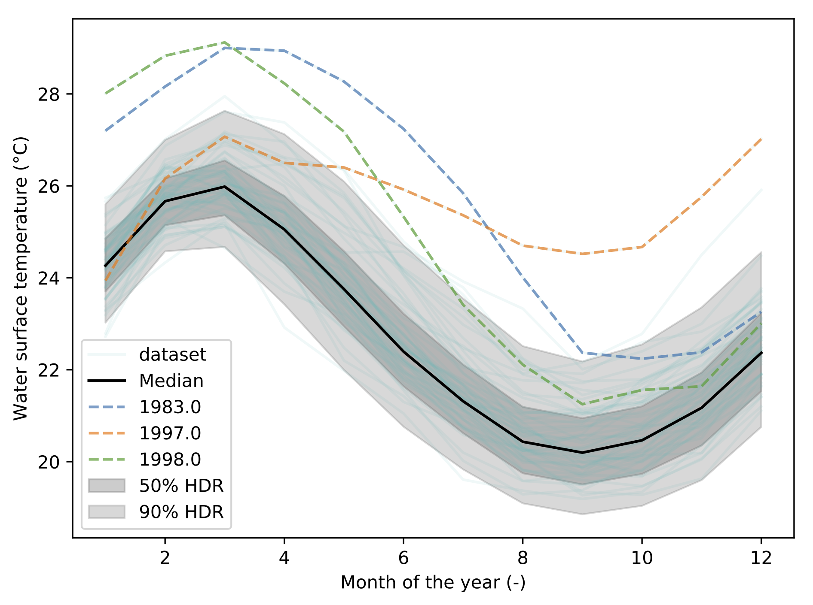

.. _visualization:

HDR-Boxplot
===========

What is it?
-----------

This implements an extension of the highest density region boxplot technique
[Hyndman2009]_. When you have functional data, which is to say: a curve, you
will want to answer some questions such as:

* What is the median curve?
* Can I draw a confidence interval?
* Or, is there any outliers?

This module allows you to do exactly this: 

.. code-block:: python
    
    data = np.loadtxt('data/elnino.dat')
    print('Data shape: ', data.shape)

    hdr = HdrBoxplot(data)
    hdr.plot()

The output is the following figure: 

How does it work?
-----------------

Behind the scene, the dataset is represented as a matrix. Each line corresponding
to a 1D curve. This matrix is then decomposed using Principal Components
Analysis (PCA). This allows to represent the data using a finit number of
modes, or components. This compression process allows to turn the functional
representation into a scalar representation of the matrix. In other words, you
can visualize each curve from its components. With 2 components, this is called
a bivariate plot:

.. image::  fig/bivariate_pca_scatter.png

This visualization exhibit a cluster of points. It indicate that a lot of
curve lead to common components. The center of the cluster is the mediane curve.
An the more you get away from the cluster, the more the curve is unlikely to be
similar to the other curves.

Using a kernel smoothing technique, the probability density function (PDF) of
the multivariate space can be recover. From this PDF, it is possible to compute
the density probability linked to the cluster and plot its contours.

.. image::  fig/bivariate_pca.png

Finally, using these contours, the different quantiles are extracted allong with
the mediane curve and the outliers.

Uncertainty visualization
-------------------------

Appart from these plots. It implements a technique called Hypothetical Outcome
plots (HOPs) [Hullman2015]_ and extend this concept to functional data. Using
the HDR Boxplot, each single realisation is superposed. All these frames
are then assembled into a movie. The net benefit is to be able to observe the
spatial/temporal correlations. Indeed, having the median curve and some intervals
does not indicate how each realisation are drawn, if there are particular
patterns. This animated representation helps such analysis::

    hdr.f_hops()

.. image::  fig/f-HOPs.gif

Another possibility is to visualize the outcomes with sounds. Each curve is
mapped to a series of tones to create a song. Combined to the previous *f-HOPs*
this opens a new way of looking at data::

    hdr.sound()

.. note:: The ``hdr.sound()`` output is an audio `wav` file. A combined video
         can be obtain with *ffmpeg*::

             ffmpeg -i f-HOPs.mp4 -i song-fHOPs.wav mux_f-HOPs.mp4

         The *gif* is obtain using::

            ffmpeg -i f-HOPs.mp4 -pix_fmt rgb8 -r 1 data/f-HOPs.gif

Kiviat 3D
=========

The HDR technique is usefull for visualizing functional output but it does not
give any information on the input parameter used. Radar plot or Kiviat plot can
be used for this purpose. A single realisation can be seen as a 2D kiviat plot
which different axes each represent a given parameter. The surface itself being
colored by the value of the function.

.. image::  fig/kiviat_2D.pdf

To be able to get a whole set of sample, a 3D version of the Kiviat plot is
used [Hackstadt1994]_. Thus, each sample corresponds to a 2D Kiviat plot::

    kiviat = Kiviat3D(space, bounds, feval, param_names)
    kiviat.plot()

.. image::  fig/kiviat_3D.pdf

When dealing with functional output, the color of the surface does not gives
all the information on a sample as it can only display a single information:
the median value in this case. Hence, the proposed approach is to combine a
functional-HOPs-Kiviat with sound::

    kiviat.f_hops(fname=os.path.join(tmp, 'kiviat.mp4'))
    hdr = HdrBoxplot(feval)
    hdr.sound()

.. image::  fig/kiviat_3D.gif

References
==========

.. [Hyndman2009] Rob J. Hyndman and Han Lin Shang. Rainbow plots, bagplots and boxplots for functional data. Journal of Computational and Graphical Statistics, 19:29-45, 2009 :download:`pdf <ref/Hyndman2009.pdf>`
.. [Hullman2015] Jessica Hullman and Paul Resnick and Eytan Adar. Hypothetical Outcome Plots Outperform Error Bars and Violin Plots for Inferences About Reliability of Variable Ordering. PLoS ONE 10(11): e0142444. https://doi.org/10.1371/journal.pone.0142444, 2015 :download:`pdf <ref/Hullman2015.pdf>`
.. [Hackstadt1994] Steven T. Hackstadt and Allen D. Malony and Bernd Mohr. Scalable Performance Visualization for Data-Parallel Programs. IEEE. 1994. DOI: 10.1109/SHPCC.1994.296663 :download:`pdf <ref/Hackstadt1994.pdf>`

Acknowledgement
===============

We are gratefull to the help and support on OpenTURNS Michaël Baudin has provided.

Sources
=======

.. automodule:: batman.visualization.hdr
   :members:
   :undoc-members:

.. automodule:: batman.visualization.kiviat
   :members:
   :undoc-members:

.. automodule:: batman.visualization.uncertainty
   :members:
   :undoc-members:
