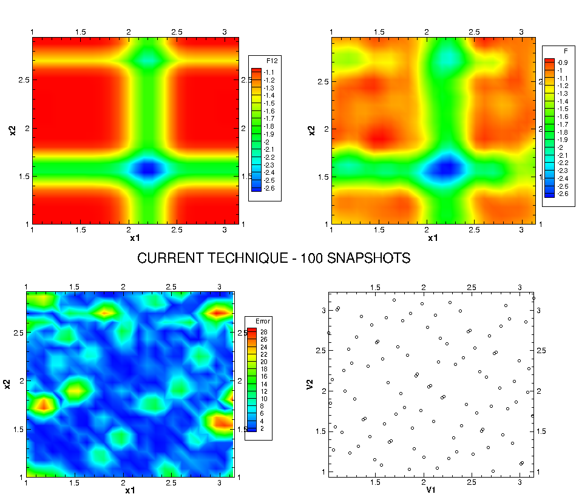
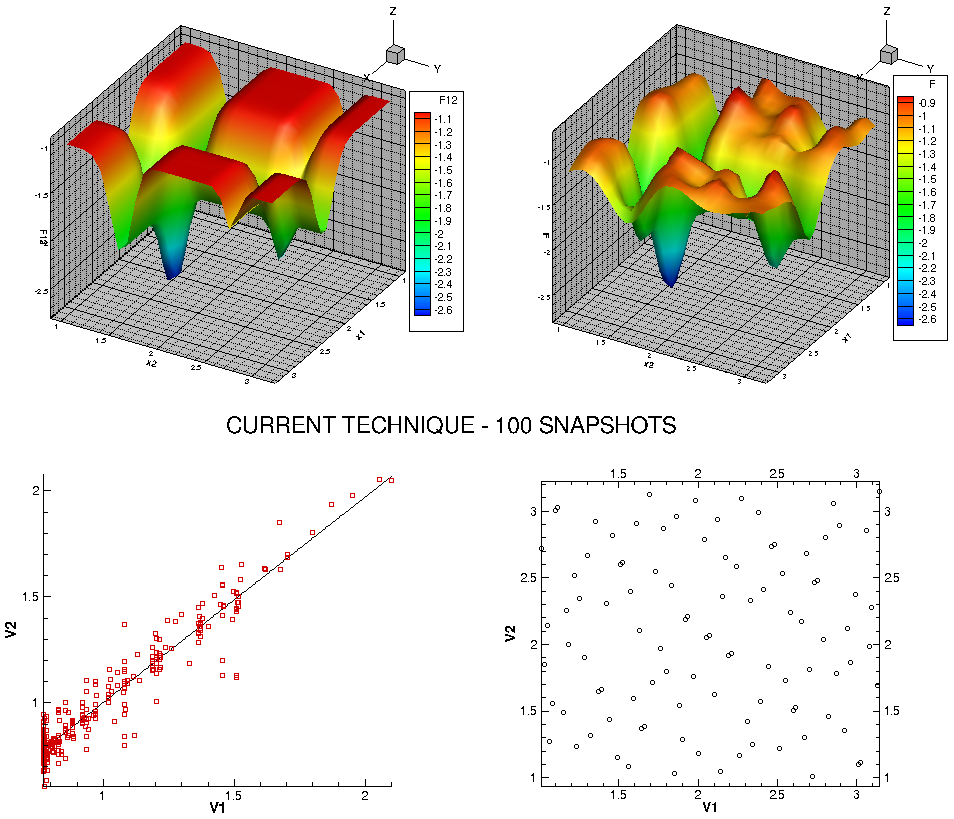

.. _tutorial:

Tutorial
========

Content of the ``test-case`` directory
--------------------------------------

Your need execute access to the ``test-cases`` directory and create there the test directories. Generally, each ``test-case`` directory consists of two main parts:

+ Directory ``data``: this directory contains files describing the code of *CFD calculation* (AVBP, elsA, etc.) or the code of *optimization test functions*, for example.

+ Directory ``scripts``: this directory contains python script files which filled by users for setting the JPOD configuration.

|

Step 1: Case configuration
--------------------------

We chose the **Michalewicz function** for this ``test-case``. For other examples of *optimization problems*, read more in the `website of Derek Bingham <http://www.sfu.ca/~ssurjano/optimization.html>`_ (please contact the author via email: dbingham@stat.sfu.ca).

|

File ``settings_template.py``
^^^^^^^^^^^^^^^^^^^^^^^^^^^^^

In fact, ``settings_template.py`` is the most important file in the directory ``scripts``. In this file, there are five different blocks:

|

Block 1 - Parameters space
""""""""""""""""""""""""""

In this block, we create the coordinate with the sampling points and chose the method to generate these points.

.. code-block:: python

    space = {'corners'     : ((1., 1.), (3.1415, 3.1415),),
              'delta_space' : 0.01,                         
              'size_max'    : 21,
              'provider'    : {'method' : 'halton',
                               'size'   : 20,
                              }
              }

+ ``corners``: Define a portion of space.
+ ``delta_space``: Make an additional exterior space with the selected space for taking sample points in the borders.
+ ``size_max``: Maximum number of point for POD automatic resampling.
+ ``method``: One of method in OpenTURNS such as: *uniform*, *halton*, *sobol*, *lhcc* (Latin Hypercube Centered) or *lhcr* (Latin Hypercube Random).
+ ``size``: Number of samples to be generated.

Some useful information
***********************

+ In *probability theory and statistics*, a **probability density function (PDF)** is used to represent a probability in the form of integrals.
+ **Uniform distribution**: Depending on the nature of the PDF, this distribution can be *continuous* or *discrete*. In the case of *Continuous uniform distribution*, according to the probability distribution, all of the intervals with the same length have the same probability. Due to the shape of the PDF, it also known as *Rectangular distribution*.
+ **Halton distribution**: It is constructed according to a *deterministic method* that uses coprime numbers as its bases.
+ **Sobol distribution**: It is an example of *quasi-random* (or *low-discrepancy*) sequence in the range from 0 to 1.
+ **Latin Hypercube distribution**: It is a statistical method for generating a near-random sample of parameter values from a multidimensional distribution. In particular, the sampling in each grid is *centered* or *random* corresponding to *LHCC* or *LHCR*.

|

Block 2 - Snapshot provider
"""""""""""""""""""""""""""

It could be *a python function*, *a python list of directories* or *a python dictionary* with settings for using *an external program* like submitting *elsA* jobs.

.. code-block:: python

     snapshot = {'max_workers' : 50,
                 'io'          : {'parameter_names'    : ['x1','x2'],
                                  'format'             : 'fmt_tp',
                                  'filenames'          : {0: ['function.dat']},
                                  'point_filename'     : 'header.py',
                                  'template_directory' : None,
                                  'variables'          : ['F'],
                                  'shapes'             : {0: [(1,)]},
                                 },
                }

+ ``max_workers``: Maximum number of simultaneous running snapshot provider.
+ ``parameter_names``: Names of the parameters.
+ ``format``:  *fmt_tp* (Tecplot 360) or *numpy* (NumPy).
+ ``filenames``: For each MPI CPU. When ran on only 1 CPU, all filenames are gathered.
+ ``point_filename``: Name of the file that contains the coordinates of a point in the space of parameters.
+ ``template_directory``: Directory to store Input/Output templates.
+ ``variables``: Names of the variables contained in a snapshot.
+ ``shapes``: Shapes of 1 variable for each file and each MPI CPU. When ran on only 1 CPU, all shapes are gathered.

Some useful information
***********************

+ **Message Passing Interface (MPI)** is a standardized and portable message-passing system designed by a group of researchers from academia and industry to function on a wide variety of *parallel computers*. For more information, please click `here <http://www.mpi-forum.org/>`_!!!
+ **Tecplot 360** is a visual data analysis tool that improves your productivity with integrated XY, 2D, and 3D plotting.
+ **NumPy** is the fundamental package for scientific computing with Python.

|

Block 3 - POD
"""""""""""""

POD (or Proper Orthogonal Decomposition) is a approach to help reduce amount of data.

.. code-block:: python

     pod = {'tolerance' : 0.99,
            'dim_max'   : 100,
            'type'      : 'static',
            'resample'  : 'extrema',
            'strategy'  : (('MSE', 2), ('loo_sobol', 0),
                           ('extrema', 1)),
            'quality'   : 0.8,
            'server'    : None,
           }

+ ``tolerance``: Tolerance of the modes to be kept. A percentage of the sum of the singular values, values that account for less than of this tolerance are ignored.
+ ``dim_max``: Maximum number of modes to be kept.
+ ``type``: Type of POD to perform: *static*, *dynamic* or *auto*.
+ ``resample``: Type of resampling strategy: *None*, *MSE* (*Mean Squared Error*), *loo_mse* (*Leave-one-out* integrates *Mean Squared Error*), *loo_sobol* (*Leave-one-out* integrates *Sobol sequence*), *extrema* or *hybrid*. Moreover, the priority order is evaluated from left to right.
+ ``strategy``: **Only** meaningful in which case ``resample`` is *hybrid*.
+ ``quality``: Stopping criterion for automatic resampling. In this example, if the value of error from approximating the surrogate model > 0,8 then it will not do the resampling. 
+ ``server``: Server settings. *None* means **no server**, the POD processing is run from the main python interpreter.

Some useful information
***********************

1. *Mean Squared Error (MSE)* of an estimator measures the average of the squares of the errors or deviations (so it also known as *Mean Squared Deviation (MSD)*). In other words, it means the difference between the estimator and what is estimated: :math:`MSE=\frac{1}{n} \sum_{i=1}^n (Y_i^{\hat} - Y_i)^2`.

2. *Leave-one-out (LOO)*: Assume that we are given a set of points in a space (for example, a surface).

    + *Firstly*, we start by taking one data point out of this set.
    
    + *Secondly*, we train a classifier with the same algorithm but without this point.
    
    + *Thirdly*, we test the classifier on this point.
    
    + To complete the procedure, we repeat these steps for all the data points.
    
    + *In short*, compute the LOO estimate as the *sum of the errors* divided by the *number of data*.

3. *Extrema*: i.e. *maxima* (or *largest value*) and *minima* (or *smallest value*) of a function.

    + When these values can be achieved on *a given range* of a function, we have the *local* (or *relative*) extrema.
    
    + In the case that they are on the *entire domain* of a function, they called the *global* (or *absolute*) extrema.

4. *Quatity*: i.e. Predictive squared correlation coefficient: :math:`Q^2=1-\frac{\sum_{i=1}^n (Y_i^{\hat} - Y_i)^2}{\sum_{i=1}^n (Y_i^{\tilde} - Y_i)^2}=1-\frac{n\cdot MSE}{\sum_{i=1}^n (Y_i^{\tilde} - Y_i)^2}`.

|

Block 4 - Prediction
""""""""""""""""""""

.. code-block:: python

    prediction = {'method' : 'kriging',
                  'points' : [ ],
                 }

+ ``method``: Method used to generate a snapshot one of *rbf* (or *Radial Basic Function*) or *kriging* method (or *KGM*).
+ ``points``: Set of points at which the predictions are made.
+ We can fill *directly* the number of points into the brackets or *indirectly* via the script.

Some useful information
***********************

1. The *RBF* is a real-valued function whose value depends only on the distance from the origin, so that: :math:`\phi(x)=\phi(||x||)`.

2. The *KGM* is a statistical prediction of a function at *untried inputs*. KGM is a flexible and robust technique to build fast *surrogate models* based on small experimental designs.

|

Block 5 - UQ
""""""""""""

UQ (or *Uncertainty Quantification*) is used as a method to evaluate the results.

.. code-block:: python

    uq = {'method' : 'sobol',
          'type'   : 'aggregated',
          'sample' : 5000 ,
          'pdf'    : ['Uniform(-2.048, 2.048)',
                      'Uniform(-2.048, 2.048)']
         }

+ ``method``: Type of Sobol analysis: *sobol*, *FAST* (or *Fourier Amplitude Sensitivity Testing*) (if FAST, no second-order indices).
+ ``type``: Type of indices we want: *aggregated* or *block*.
+ ``sample``: Use a test method: *Ishigami*.
+ ``pdf`` (or *Probability density function*): Uncertainty propagation. Enter the PDF of the inputs: x1: Normal(mu, sigma), x2: Uniform(inf, sup).

Some useful information
***********************

1. The *FAST* is a variance-based global sensitivity analysis method. The sensitivity value is defined based on conditional variances which indicate the individual or joint effects of the uncertain inputs on the output.

2. The *Ishigami function* of Ishigami & Homma (1990) is used as an example for uncertainty and sensitivity analysis methods, because it exhibits strong nonlinearity and nonmonotonicity. For more information, please visit the `Derek Bingham website <http://www.sfu.ca/~ssurjano/ishigami.html>`_!!!

|

File ``function.py``
^^^^^^^^^^^^^^^^^^^^

Beside the ``settings_template.py``, we take the ``function.py`` in the directory ``data`` to describe the information of *optimization test functions*. Keep in mind that the test case here is *Michalewicz function*.

.. code-block:: python

    F = -1.0-math.sin(X1)*(math.pow(math.sin(X1*X1/math.pi),20.))-math.sin(X2)*(math.pow(math.sin(2*X2*X2/math.pi),20.))

|

.. note:: Simplistically, we change **only** the *function formula* and *coordinate* for other optimization test functions.

|

Step 2: Running JPOD
--------------------

It is executed when we run 2 python files: ``ui.py`` (in the directory ``jpod`` of the repository ``kernel``) and ``task.py`` (in the directory ``scripts`` of the repository ``test_cases`` that we are considering).

|

File ``pod.sh``
^^^^^^^^^^^^^^^

For greater convenience, we create a batch script ``pod.sh`` to run the above files:

.. code-block:: bash

    #!/bin/bash
    #SBATCH --partition prod
    #SBATCH --time=00:10:00
    #SBATCH --nodes=1 --ntasks-per-node=1
    #SBATCH --job-name=JPOD
    ##SBATCH --mail-user ...@cerfacs.fr
    ##SBATCH --mail-type all
    #SBATCH --share

    module load application/openturns/1.7
    module load python/3.3.6

    cd ${SLURM_SUBMIT_DIR}

    python ~/JPOD/kernel/jpod/ui.py scripts/task.py -s

.. note:: If you want to modify your batch script, the section *Queuing & running jobs (SLURM)* in `the CERFACS document <http://shou.cerfacs.fr/index.php?page=/ressources_informatiques/ressources_internes.php>`_
 is helpful. 

|

You can launch JPOD by typing the following command:

.. code-block:: bash

    sbatch pod.sh

In this example, you *Submitted batch job 125969*. To active and waiting jobs, you can verify:

.. code-block:: bash

    squeue -u USERNAME

To view cluster status:

.. code-block:: bash

     JOBID  PARTITION  NAME  USER  STA  TIME  TIME_LIMI  NODE  PRIORITY  NODELIST(REASON)           START_TIME
    125969      debug  JPOD   XXX  RUN  0:05      10:00     1      6002           node251  2016-07-11T12:11:46

Finally, you receive the result of JPOD calculation: 

.. code-block:: bash

    JPOD main ::
        POD summary:
        modes filtering tolerance    : 0.99
        dimension of parameter space : 2
        number of snapshots          : 20
        number of data per snapshot  : 1
        maximum number of modes      : 100
        number of modes              : 1
        modes                        : [ 1.69972346]

|

Step 3: Post-treatment
----------------------

All of result files located in 3 directories: ``pod``,   ``predictions`` and ``snapshots`` of the directory ``output``. You can use these files for post-treatment with some available softwares such as: *paraview*, *tecplot*, etc.

In this example, we take five result files: ``Ref_Function_2D.dat``, ``Function_2D.dat``, ``Sampling_2D``, ``Error_2D``, ``Error_R2.dat`` and open them with a visual data analysis tool *Tecplot 360*. Here are the images that we obtain:

|

|

A white subfigure at the bottom right describes a *sampling technique*.

Two subfigures at the bottom left correspond a *Maximum error* :math:`L_max` and a *Coefficient of determination* :math:`R^2` with a trend-line. As close to a linear trend-line, the points get more precision.

Meanwhile, two subfigures at the top in both cases, from left to right, correspond the *reference* and *prediction functions*. We noticed that the results look quite similar, i.e. the distributions get good solutions.